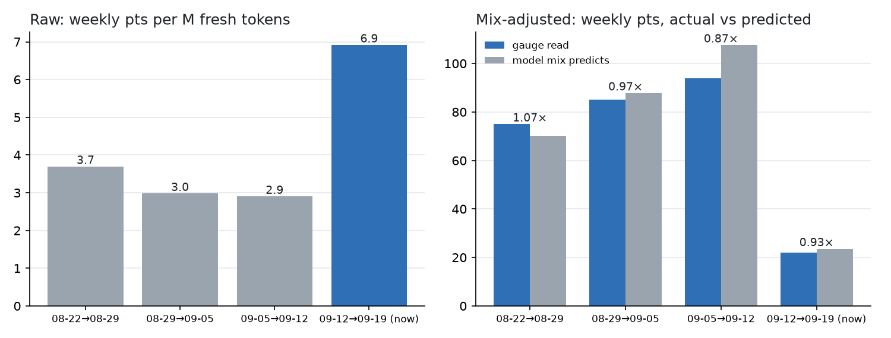
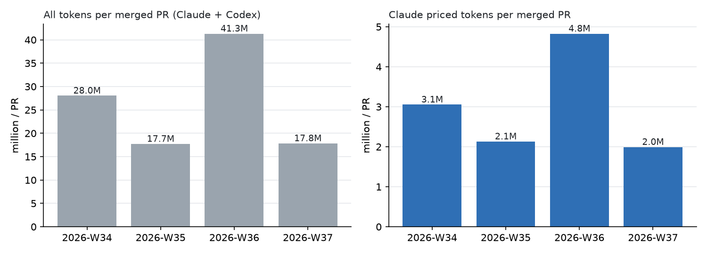
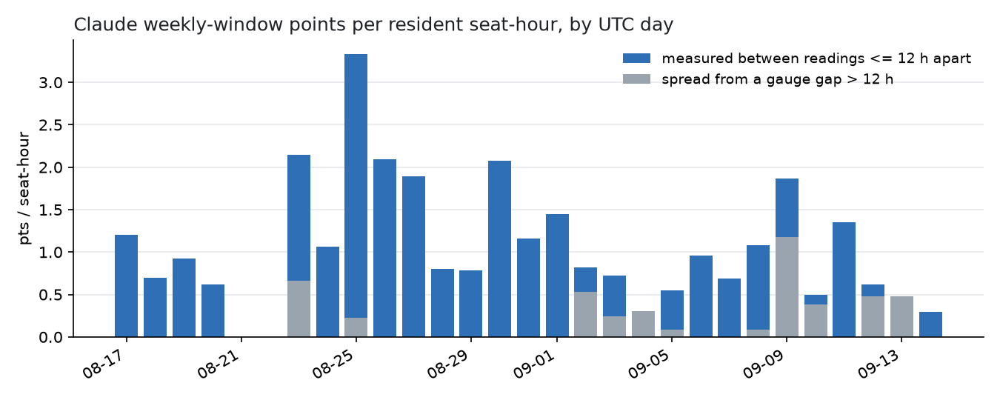

# The cost of a week: did the price of our work change?

*As of 2026-09-14T10:30Z. A read-only measurement over files on the maintainer's
machine. The tables and charts come from `scripts/cost_of_a_week.py`
([how to reproduce](#reproduce)). A few side checks (the ledger cross-check,
ledger field coverage, squash-merge share, the seat's median prompt) were
one-off queries over the same files and are marked where they appear.*

## The answer

**No change in the price of a token shows up.** Measured in Claude's own weekly
windows, the current one (opened 2026-09-12 12:00Z) is filling about **2.3×
faster per token** than the three before it: 6.91 points per million fresh
tokens, against 3.70, 2.98 and 2.90. The whole difference is **which model the
work runs on**. Fable was 21–31 % of Claude's priced tokens in earlier windows
and is **76 %** now. The seat that woke 2026-09-12 15:13Z runs on Fable, and
its median prompt is 452k tokens (one-off query: its 469 Fable calls since waking). Allow for the model mix and the current
window reads **0.93×** what the earlier windows predict. The earlier windows,
each predicted from a fit that leaves its own days out, read 1.07×, 0.97× and
0.87×.

A second check needs no model at all. The Fable bucket, which counts only
Fable, cost **19.2** points per million Fable fresh tokens this window, against
18.5, 26.5 and 20.9 before. It is flat.

What the data can't rule out: a change of less than roughly ±15 %, which is
the spread of the out-of-sample check. It also can't see a change to the 5-hour
session window (see [thin places](#where-the-data-is-thin)).



## Four weeks, per ISO week (UTC)

| week | seat-hours | PRs merged | tokens: resident | tokens: strands | Claude weekly pts | tokens / PR | Claude priced tokens / PR | Claude pts / seat-hour |
| --- | --- | --- | --- | --- | --- | --- | --- | --- |
| 2026-W34 | 65.4 | 105 | 1,477.4M | 1,467.5M | 55 (4 spread) | 28.0M | 3.1M | 0.84 |
| 2026-W35 | 52.7 | 97 | 1,435.2M | 284.5M | 84 (1 spread) | 17.7M | 2.1M | 1.59 |
| 2026-W36 | 125.8 | 77 | 1,215.5M | 1,966.1M | 96 (22 spread) | 41.3M | 4.8M | 0.76 |
| 2026-W37 | 97.0 | 106 | 1,233.4M | 650.7M | 80 (34 spread) | 17.8M | 2.0M | 0.82 |
| 2026-W38 (10.5 h) | 10.5 | 1 | 35.1M | 27.5M | 3 | — | — | — |

- **Tokens** count Claude and Codex together, including cache reads, from
  brnrd's own runs only (other repos and interactive sessions are excluded;
  interactive use was 7.9M in W37 and zero otherwise). Cache reads are 98–99 %
  of all tokens, so fresh tokens per PR stay at 0.3–0.5M every week. The full
  split by shell is in the script's output.
- **Priced tokens** are input-token equivalents at Anthropic's published
  ratios: uncached input 1, cache write 1.25, cache read 0.1, output 5.
- **Claude weekly pts** is points of the Claude weekly gauge consumed in that
  ISO week. `spread` is the part that came out of a gap of more than 12 h
  between readings, spread over the hours that drew tokens. It is an estimate
  of *when*, not *how much*.
- A seat-hour is an hour in which at least one resident (non-strand) run was
  open, overlaps merged. W36 is high because the seat stayed awake across whole
  days.

Tokens per merged PR went 28.0M → 17.7M → 41.3M → 17.8M. That swings with how
much strand work there was (W36: 1,966M strand tokens for 77 PRs). It is not
trending.



## Per Claude weekly window

ISO weeks cut across Claude's week, which runs Friday 12:00Z to Friday 12:00Z
(the anchor was Thursday 22:00Z until the 2026-08-20 window; see thin places).
Here points are the gauge's own. Tokens are Claude transcripts from the window's
start to its last reading.

| window (UTC) | last reading | points | fresh tokens | total tokens | pts / M fresh | pts / 100M total | seat-hours | pts / seat-hour | PRs | pts / PR |
| --- | --- | --- | --- | --- | --- | --- | --- | --- | --- | --- |
| 08-22 12:00 → 08-29 12:00 | 08-29 11:13 | 75 | 20.3M | 1,458.1M | 3.70 | 5.14 | 47.0 | 1.60 | 106 | 0.71 |
| 08-29 12:00 → 09-05 12:00 | 09-05 02:46 | 85 (2 resets) | 28.5M | 2,300.5M | 2.98 | 3.69 | 99.7 | 0.85 | 67 | 1.27 |
| 09-05 12:00 → 09-12 12:00 | 09-12 08:55 | 94 | 32.4M | 2,494.1M | 2.90 | 3.77 | 95.7 | 0.98 | 119 | 0.79 |
| **09-12 12:00 → now** | 09-14 10:29 | 22 | 3.2M | 288.7M | **6.91** | **7.62** | 44.3 | 0.50 | 17 | 1.29 |

Fable bucket, Fable tokens only:

| window (UTC) | points | Fable fresh tokens | pts / M fresh | pts / 100M total |
| --- | --- | --- | --- | --- |
| 08-22 12:00 → 08-29 12:00 | 96 | 5.2M | 18.51 | 20.62 |
| 08-29 12:00 → 09-05 12:00 | 131 (3 resets) | 5.0M | 26.45 | 23.13 |
| 09-05 12:00 → 09-12 12:00 | 109 (1 reset) | 5.2M | 20.92 | 19.09 |
| **09-12 12:00 → now** | 37 | 1.9M | **19.21** | **17.12** |

The previous window ended at the wall. The Claude weekly gauge read 94 % at
2026-09-12 03:06Z, and the Fable bucket sat at 97 % from 2026-09-09 until the
reset. Per seat-hour the current window is the *cheapest* of the four (0.50).
The seat is awake for many hours in which it draws little.

## The mix-adjusted test

Model: `weekly points = w_fable·F + w_opus·O + w_sonnet·S`, where F, O and S
are priced tokens per model family (Haiku, at most 4 % in any week, is folded
into Sonnet). The weights are fitted with non-negative least squares on 19 days
of clean gauge intervals before the current window. A clean interval has both
readings in the same window, no reset, and at most 12 h between them.

| family | weekly pts per M priced tokens | relative to Sonnet |
| --- | --- | --- |
| Fable | 0.797 | 6.0× |
| Opus | 0.259 | 1.9× |
| Sonnet | 0.134 | 1.0× |

| window | priced mix | priced at >200k context | actual pts | predicted pts | actual / predicted | fit days |
| --- | --- | --- | --- | --- | --- | --- |
| 08-22 → 08-29 | fable 31 % · opus 30 % · sonnet 39 % | 61 % | 75 | 70.3 | 1.07 | 14 (own days left out) |
| 08-29 → 09-05 | fable 23 % · opus 23 % · sonnet 53 % | 62 % | 85 | 87.8 | 0.97 | 14 (own days left out) |
| 09-05 → 09-12 | fable 21 % · opus 24 % · sonnet 54 % | 65 % | 94 | 107.6 | 0.87 | 11 (own days left out) |
| **09-12 → now** | fable 76 % · opus 14 % · sonnet 10 % | 82 % | **22** | **23.6** | **0.93** | 19 |

The share of priced tokens at more than 200k context also rose, from 61–65 % to
82 %. The fit doesn't need a separate long-context term: mix alone predicts the
window to within its usual error. Long context isn't ruled out as a
contributor, though. With one current window the two causes can't be
separated, and they move together because the seat is both Fable and long.

## Step or no step, by day

The script scans every split date that leaves at least 4 usable days (≥ 3
points) on each side. It ranks the splits by the before/after ratio of pooled
points per token and gives a two-sided Mann-Whitney p on the daily ratios.

| series | biggest split | days before / after | intervals before / after | after ÷ before | p |
| --- | --- | --- | --- | --- | --- |
| Claude weekly, per fresh token | 2026-08-29 | 4 / 14 | 30 / 681 | 0.58 (cheaper) | 0.056 |
| Claude weekly, per total token | 2026-08-29 | 4 / 14 | 30 / 681 | 0.65 (cheaper) | 0.243 |
| Fable bucket, per Fable fresh token | 2026-09-06 | 8 / 4 | 66 / 55 | 1.13 | 0.396 |
| Fable bucket, per Fable total token | 2026-09-06 | 8 / 4 | 66 / 55 | 0.84 | 0.234 |
| Codex weekly (control), per fresh token | 2026-09-10 | 19 / 4 | 7,664 / 1,141 | 0.65 | 0.019 |
| Codex weekly (control), per total token | 2026-09-05 | 14 / 9 | 6,493 / 2,312 | 1.52 | 0.020 |

**No step that persists.** The largest Claude split points toward *cheaper*
work after 2026-08-29. It has only 4 days before it, and it lines up with
Sonnet's share rising (W36: 68 %). The Fable split is +13 % per fresh token and
−16 % per total token: noise, not a direction. The Codex control is the
calibration. It shows "significant" splits (p ≈ 0.02) in both directions
across 15–20 candidate dates, and we have no reason to think Codex changed.
With this many candidate dates, a day-level p near 0.02 is what noise looks
like. The daily tables are in the script's output (clean intervals only; the
current window has a single clean day, 2026-09-14).



## Method

- **Tokens**: the Claude Code transcripts, `~/.claude/projects/**/*.jsonl`.
  One API message is written as several rows, so rows are deduplicated on
  `(message.id, requestId)`, keeping the largest value of each usage field.
  Checked against `.brr/run-ledger.jsonl` on the ten most recent Claude runs
  with a local transcript: 6 match to the token, 4 are 0.1–4.2 % *under*
  (transcripts lost a few messages). So tokens may undercount by a few percent,
  about equally in every window.
  Transcripts also cover the live seat and runs whose ledger row has no token
  fields. Codex tokens come from `~/.codex/sessions/**/rollout-*.jsonl`
  (differences of the cumulative `total_token_usage` per session).
  Resident/strand attribution uses the run id in the transcript's directory or
  `cwd`, looked up in that run's `state.md` (`source: spawn` means strand).
  Transcripts in the main checkout with `entrypoint: sdk-cli` count as
  resident.
- **The Claude gauge**: `claude-usage-levels.json` in every run dir (a
  `/usage` reading taken at run close) plus the Claude rows of
  `.brr/usage-samples.jsonl`. Row shape of the samples:
  `{at, shell, used_percent, window_minutes, resets_at}`, with
  `window_minutes` 300 (session) or 10080 (week). Readings are integers.
- **Consumed points**: consecutive readings, reset-aware, read as a high-water
  mark. Readings from parallel sessions dither by a point (19, 20, 19, 20
  within a minute). Treated naively, that produced 39 fake resets and 743
  phantom points; with the high-water mark it gives 3 real resets. A fall of at
  least 5 points inside a window is a reset. A changed `resets_at` is a
  rollover, where the new window's first reading counts from zero.
- **Seat-hours**: `started_at`→`ended_at` of every non-spawn run, merged where
  runs overlap. The live seat is open until the as-of time.
- **Merges**: `git log origin/main --first-parent` after `git fetch`, by
  committer date. A PR counts when the subject is `Merge pull request #N` or
  ends in `(#N)`. 4–34 % of first-parent commits each week are single-parent
  (18/112, 4/97, 9/78, 36/106 for W34–W37), mostly squash merges, so counting
  two-parent commits alone would miss them.

## Where the data is thin

- **`usage-samples.jsonl` keeps 10 hours.** This is by design:
  `usage_samples._RETENTION_HOURS = 2 × BURN_HORIZON_HOURS`. On 2026-09-14 it
  covered 00:27→10:26Z, so it can't span weeks. The gauge history above comes
  from run-dir snapshots instead.
- **The blind weekend.** A run-dir snapshot is written when a run closes, and
  the seat hasn't closed since 2026-09-12 15:13Z. No Claude weekly reading
  exists from **2026-09-12 15:08Z (1 %) to 2026-09-14 00:37Z (19 %)**, a
  33.5 h gap. The 18 points in it are real, but *when* they were drawn is
  estimated: they are spread by token weight, and that is the grey in the
  seat-hour chart. The same happens on smaller scales on 09-02..09-04 and
  09-09..09-10.
- **Transcripts only reach back to 2026-08-14.** That is consistent with
  Claude Code's default 30-day transcript cleanup. W34 is covered from its
  first day. A re-run after about 2026-09-16 loses W34's first days.
- **Re-runs drift in the last 10 hours.** Tables are byte-identical across
  re-runs with the same `--as-of` (checked) *while the sample log still holds
  those rows*. Once the samples age out, the current window keeps only its
  run-dir snapshots (last Claude weekly one: 2026-09-14 06:30Z at 21 %), so its
  22 points can read 21.
- **Gauge coverage per ISO week is uneven.** W34 has no usable Claude reading
  on 2026-08-21 (eight snapshots, all with an empty `/usage` scrape) or 08-22, and the 2026-08-20 window's tail (after its 70 % reading)
  was lost at the reset. The 08-14..08-24 snapshots carry no `resets_at`, so
  those intervals are "reset unknown". W34's 55 points undercount. The
  per-window table starts at 08-22 for this reason.
- **The weekly reset anchor moved.** Windows ended Thursday 22:00Z through
  2026-08-20 and Friday 12:00Z from 2026-08-29. The 2026-08-22..08-29 window
  is the first with the new anchor. There was also a mid-window reset on
  2026-09-01 (35 → 5) and another on 09-04/05 (36 → 5).
- **The ledger's own token fields are thin.** `run-ledger.jsonl` has token
  fields on 139/152 (W34), 77/85, 76/100 and 55/99 (W37) rows, and
  `weekly_pct_delta` on only 26, 58, 24 and 37 rows. The ledger has no row for a
  run that hasn't closed, including the seat. That is why transcripts, not the
  ledger, are the token source.
- **The gauge is account-wide; tokens are this machine's.** Claude use on
  another device (claude.ai, the phone app) moves the gauge without appearing
  here. It would show up as extra points per token, and nothing did.
- **Only a few weights.** Three weights fitted on 19 days, with correlated
  mixes. The out-of-sample error (0.87–1.07) is the honest error bar, not the
  weights' precision.
- **Not measured: the 5-hour session window.** Run-dir snapshots are a handful
  per 5 h window, and the minute-resolution samples exist only for the last
  10 h. A 5 h limit change would need the sample log kept longer.

## Spec corrections

- `v0.6.19` is tagged **2026-09-07**, one week back, not three. The analysis is
  windowed by ISO week from W34 (2026-08-17) instead.
- "A merge is a first-parent commit on main" would count direct commits (up to
  15 a week in W34) and relies on merge commits. PRs are counted by subject.
- The "Fable window" is not in `usage-samples.jsonl`; only run-dir snapshots
  carry `week_models.Fable`.

## Reproduce

```sh
git fetch origin
python3 scripts/cost_of_a_week.py --as-of 2026-09-14T10:30:00Z            # tables
python3 -m venv /tmp/v && /tmp/v/bin/pip install matplotlib
/tmp/v/bin/python scripts/cost_of_a_week.py --as-of 2026-09-14T10:30:00Z --charts media/cost
```

Runtime is about 7 s over 1.1 GB of transcripts and 300 MB of rollouts.
Nothing is written except stdout and the charts.
