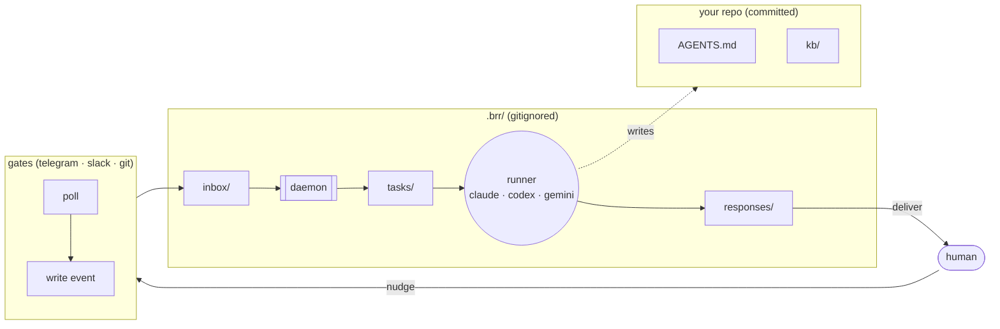
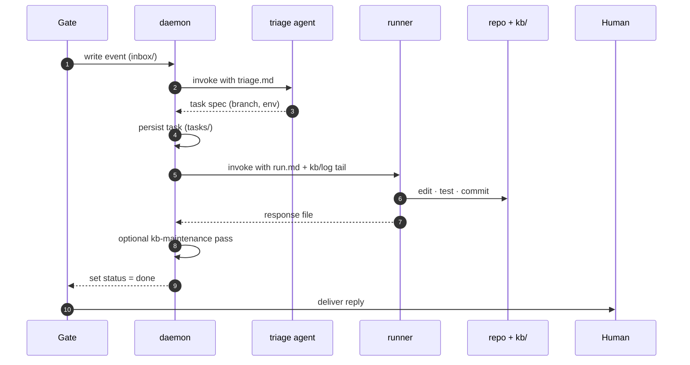

<!-- _class: lead -->

# brr

## playbook + remote execution for AI agents, per repo

`stdlib Python` · `zero runtime deps` · `self-hosted`

---

# the problem brr answers

Running AI agents against real repos has two uncovered needs.

1. **Agent behaviour drifts every session.** Each tool has its own config format. Conventions you care about are lost between runs.  → needs a **persistent playbook**.
2. **You want to nudge an agent without opening an IDE.** From a phone, a chat, a PR comment.  → needs a **remote channel**.

brr solves both with one codebase:

- `AGENTS.md` + `kb/` — a playbook every AI tool already reads.
- `brr up` — a daemon that turns Telegram / Slack / Git into task events.

---

# two layers in one repo



Left half: steering config (committed). Right half: runtime plumbing (gitignored). No shared state beyond the filesystem.

---

# the file protocol

Every handoff between components is a markdown file with frontmatter.

| artefact    | path                          | writer → reader       |
|-------------|-------------------------------|-----------------------|
| event       | `.brr/inbox/<id>.md`          | gate → daemon         |
| task        | `.brr/tasks/<id>.md`          | triage → worker       |
| response    | `.brr/responses/<id>.md`      | agent → gate          |
| trace       | `.brr/traces/<kind>/…/`       | runner → operator     |
| gate state  | `.brr/gates/<gate>.json`      | gate ↔ gate           |

**No shared memory. No bus. Atomic write-then-rename.**
A bash script can be a gate. The protocol spec is one page.

---

# the pipeline



One event → one triage call → one task → one runner call → one response. Serial in v1.

---

# triage decides two things

The triage agent receives the event body + last 3 log entries and emits a task spec. It only decides:

1. **branch** — `current` / `auto` / `task` / `<name>` / `new:<name>`
2. **env** — `local` / `worktree` / `docker`

Then the worker executes. If the branch is not `current`, a worktree is created under `.brr/worktrees/<task-id>/` and removed after merge.

That's the whole control plane. No scheduling, no priorities, no queues — just: *classify, execute, respond*.

---

# CLI surface (ten verbs)

Setup

- `brr init [url]` — adopt or clone-and-adopt a repo; creates `AGENTS.md`, `kb/`, `.brr/`
- `brr setup <gate>` — configure a gate in one step
- `brr auth <gate>` · `brr bind <gate>` — advanced split setup

Run

- `brr run "<task>"` — one-shot, synchronous
- `brr up [--debug]` · `brr down` — foreground daemon

Observe

- `brr status` — daemon + recent tasks + worktrees
- `brr inspect <task-id>` — full manifest for a task
- `brr docs [topic]` — bundled tool documentation
- `brr eject` — copy bundled prompts to `.brr/prompts/` for editing

Ten verbs. That is the whole surface.

---

# where state lives

```
┌──────────────────────────────────────────┐
│  src/brr/                    (machinery) │   upgraded via pip
│    daemon · runner · gates                │
│    prompts/   (bundled defaults)          │
│    docs/      (tool reference)            │
└──────────────────────────────────────────┘
┌──────────────────────────────────────────┐
│  <your repo>                 (playbook)  │   committed
│    AGENTS.md                              │
│    kb/                                    │
└──────────────────────────────────────────┘
┌──────────────────────────────────────────┐
│  <your repo>/.brr/           (runtime)   │   gitignored
│    inbox  tasks  responses                │
│    traces  worktrees  gates/              │
│    prompts/   (per-repo override)         │
│    config                                 │
└──────────────────────────────────────────┘
```

Three containers. Each has one job. No aliasing.

---

# the override model today

Two-layer lookup for every prompt and doc:

```
src/brr/prompts/<x>.md       ← bundled default
.brr/prompts/<x>.md          ← per-repo override (wins)
```

- `brr eject` copies bundled prompts for editing.
- Same pattern under `docs/`.

**What it covers.** "This one repo wants a different AGENTS.md template."

**What it doesn't.** "Update my personal workflow across 20 repos at once."

That's the steering problem. → see **deck 2**.

---

# what's strong today

- **One brr-driven repo is pleasant.** `init` → `auth` → `up`. Nudge from phone. Commits land.
- **Debuggable.** Every runner invocation is a directory with prompt, stdout, stderr, artefacts, meta. `--debug` keeps worktrees too.
- **Portable.** Stdlib-only, three gate modules, any runner that takes a prompt on argv.
- **Honest abstractions.** Event · Task · Response · Trace. Nothing hidden behind a framework.

# what hurts today

- **N repos.** Each its own daemon. No fleet view. No cross-repo policy.
- **Overlay.** Personal prompt tweaks live in every `.brr/prompts/` or nowhere.
- **Concurrency.** Worktree scaffold exists; merge coordinator doesn't. Serial in v1.
- **Environments.** `env: docker` is in the Task type but not implemented.

→ **Deck 2** addresses all four as one coherent design.
