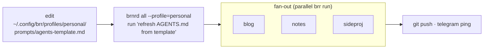
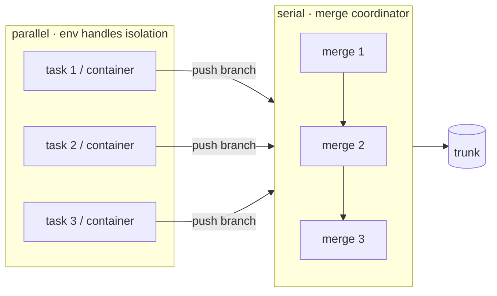

<!--
Status: roadmap — read for the three-axis frame, not as a current spec.
Current synthesis: [subject-fleet-overlays.md](subject-fleet-overlays.md).
Axis 3 (Environment) is in flight via design-env-interface.md;
Axis 1 (Overlay) is paused behind the env work, see plan-overlays.md;
Axis 2 (Fleet / brnrd) is future work.

Some specifics in this deck have been overtaken by later decisions:
  - the LLM triage stage was removed (decision-remove-triage.md);
  - workstreams were removed in favour of the per-gate-thread
    conversation log (decision-drop-streams.md);
  - the per-task `kb/log-<task-id>.md` mechanism is gone
    (decision-kb-shape.md).
Read those decisions alongside this deck if you need the current shape.
-->


<!-- _class: lead -->

# brr — fleet & steering

## scaling from 1 brr to N

**overlays** · **brnrd** · **environments**

---

# thesis

> brr wins when **steering is cheap** and the **fleet is visible**.

Today a single brr in a single repo is solid. The next 10× of value is in:

- changing agent behaviour across many repos **without touching each repo**
- seeing / commanding your brrs as a **set**, not a list of tmux panes
- running tasks in **environments beyond a worktree** without asking users to write wrappers

These are three independent axes. Ship them independently.

---

# the three axes, untangled

The idea-page conflates these. Separating them is the whole insight.

|     | Axis              | Question                                          | Shape                 |
|-----|-------------------|---------------------------------------------------|-----------------------|
| A1  | **Overlay**       | how do I change behaviour across many repos?      | lookup chain          |
| A2  | **Fleet**         | how do I see / command all my brrs at once?       | `brnrd` supervisor    |
| A3  | **Environment**   | where does a task actually execute?               | `Env` interface       |

They interact, but none depends on the others for correctness. Pick any subset to ship first.

---

<!-- _class: lead -->

# A1 — Overlays

## thoughtless by default · one file, one line, done

---

# the user journey

> Ana has 20 repos. Ten are work, ten are personal on GitLab.
> She wants her *personal* repos to use a warmer commit-message tone, prose-style kb logs, and auto-bind the `gitlab` gate.

**Today.** Edit `.brr/prompts/agents-template.md` in 10 repos. Reword? Edit 10× again.

**With overlays.**

```
~/.config/brr/profiles/personal/prompts/agents-template.md
~/.config/brr/profiles/personal/config
```

Any repo tagged `profile=personal` picks it up. Edit **once**, ten brrs read it on the next run.

---

# shape: 4-layer lookup chain

```
bundled         →  ~/.config/brr/default/  →  ~/.config/brr/profiles/<name>/  →  .brr/prompts/
(shipped w/pip)    (your machine global)      (your workflow variant)            (this repo)
```

Principles (decisions already taken):

- **single slot.** One `profile=` per repo. No stacking. Debuggable by construction.
- **pull-on-next-run.** Overlay is read live. Edit overlay → next agent run sees it. No copies, no sync.
- **prompts + config defaults.** Docs stay bundled; they describe brr itself.
- **`.brr/prompts/` still wins.** The per-repo escape hatch is preserved.

---

# what belongs in an overlay

Audited by asking: *does this vary per user, not per repo?*

| file / artefact                 | per-user varies | in overlay    |
|---------------------------------|-----------------|---------------|
| `agents-template.md`            | heavily         | **yes**       |
| `kb-index.md` / `kb-log.md`     | yes             | **yes**       |
| `setup.md`                      | yes             | **yes**       |
| `kb-maintenance.md`             | yes             | **yes**       |
| `triage.md`                     | somewhat        | **yes**       |
| `run.md`                        | rarely          | **yes**       |
| `runners.md`                    | yes (PATH/flags)| **yes**       |
| `.brr/config` defaults          | yes             | **yes**       |
| `src/brr/docs/*`                | no              | no            |

**Rule.** If it steers the agent → overlay. If it describes brr itself → stays bundled.

---

# mechanics — what actually changes in code

```python
# src/brr/runner.py — the only resolution site
def _read_prompt(name: str, repo_root: Path | None = None) -> str:
    profile = _profile_for(repo_root)          # from .brr/config
    for root in (
        repo_root / ".brr" / "prompts" if repo_root else None,
        _USER_CFG / "profiles" / profile / "prompts" if profile else None,
        _USER_CFG / "default" / "prompts",
        _BUNDLED_PROMPTS,
    ):
        if root and (root / name).exists():
            return (root / name).read_text(encoding="utf-8")
    return ""
```

```
_USER_CFG = Path(os.environ.get("BRR_CONFIG_HOME", "~/.config/brr")).expanduser()
```

`.brr/config` gains one optional line: `profile=personal`.

**~20 LOC. No new concepts. Back-compat by construction** (absent overlay dirs ⇒ current two-layer behaviour).

---

# remote-editable overlays — the dir is a git clone

The overlay is a directory. Nothing stops that directory from being a git
checkout of a repo the user controls (self-hosted gitea, private GitHub,
GitLab — whatever). Make that the **blessed** path, not a side-workflow.

```
$ git clone git@gitlab.me:ana/brr-overlay.git ~/.config/brr
```

- **Edit from anywhere.** Web IDE, phone, another machine. `git push`.
- **Versioned.** Diff-able, revertible, branchable for experiments.
- **Offline-safe.** Last `git pull` is the ground truth until the next sync.
- **Self-hosted-ideology-native.** Ana owns the repo, brr doesn't care where it lives.

Sync policy per machine (`.brr/config`):

| value                 | behaviour                                                    |
|-----------------------|--------------------------------------------------------------|
| `overlay_sync=auto`   | `git -C $BRR_CONFIG_HOME pull` if last pull > N min old      |
| `overlay_sync=always` | pull before every task                                       |
| `overlay_sync=never`  | manual only (`brr overlay sync` or fleet-wide `brnrd overlay sync`) |

**Same gate-as-filesystem spirit.** A push to the overlay repo *is* the event; the next run is the delivery. Zero new transport.

---

# overlay CLI (minimal surface)

```
brr eject --global                  # seed ~/.config/brr/default/ from bundled
brr eject --profile=personal        # seed a profile from bundled
brr profile set personal            # write profile= in this repo's .brr/config
brr profile show                    # print resolved lookup chain for this repo
```

Four new sub-verbs on the existing `brr` binary. No new command, no new concept the user has to learn if they don't want overlays.

---

<!-- _class: lead -->

# A2 — brnrd

## the uberbot · one knob for N brrs

---

# why a separate tool

`brr` is **per-repo**. It should never know about other repos — that stays honest.

`brnrd` is **per-user**. It knows about the fleet and nothing else.

```
brr      →  "do the thing in THIS repo"
brnrd    →  "do the thing in some subset of MY repos"
```

Packaging: lives alongside `brr` (`src/brnrd/` in the same repo, separate entry point) or sibling repo. `brnrd` depends on `brr`; never the reverse. The boundary stays clean either way.

---

# what brnrd actually is

Three things in one CLI — each optional.

1. **Registry.** `~/.config/brr/fleet.toml` — flat list of repo paths with tags and profile.
2. **Broadcaster.** `brnrd all [--tag=X | --profile=Y] <cmd>` fans a `brr` subcommand across matching repos.
3. **Supervisor daemon (later).** `brnrd up` — one long-running process that owns N `brr up` subprocesses.

Ship **1 + 2** as v1. Add **3** only when users ask for it. Registry + broadcast are enough to unblock the gitlab story end-to-end.

---

# the registry

```toml
# ~/.config/brr/fleet.toml
default_profile = "default"

[[repo]]
path    = "~/src/work/alpha"
tags    = ["work"]
profile = "work"

[[repo]]
path    = "~/src/personal/blog"
tags    = ["personal", "gitlab"]
profile = "personal"
```

Lifecycle:

- `brnrd adopt ~/src/personal/* --tag=personal --profile=personal`
- `brnrd forget blog`
- `brnrd tag blog --add=public`
- `brnrd ls`

One TOML file is the entire source of truth for "my fleet."

---

# fleet UX — what it feels like

```
$ brnrd ls
path                     daemon   profile     last task   pending
work/alpha               ● up     work        2h ago      0
work/beta                ○ down   work        —           0
personal/blog            ● up     personal    12m ago     1
personal/notes           ● up     personal    —           0

$ brnrd all --profile=personal run "bind gitlab gate"
→ personal/blog          ✓  done in 4.2s
→ personal/notes         ✓  done in 3.1s

$ brnrd all --tag=work up
→ work/alpha             already up (pid 2834)
→ work/beta              started (pid 9091)
```

Selectors: `--tag=`, `--profile=`, `--path=<glob>`, or unset = all.
Commands: any `brr` subcommand. `brnrd` is a fan-out, not a reinvention.

---

# the gitlab scenario end-to-end



One edit. One broadcast. Three repos converge. No per-repo ceremony.

---

# brnrd as supervisor (phase 4)

When the fleet grows past ~5 repos, manually managing `brr up` gets tedious.

```
brnrd up                       ← one long-running process
  ├─ brr up in alpha            (subprocess · restart on crash)
  ├─ brr up in beta
  └─ brr up in blog
```

Adds: systemd-style unit, shared secret cache, unified log stream, health check loop.
Does **not** add: cross-repo task coordination. Each brr stays independent — that's a feature.

**Deferred.** `brnrd ls` + `brnrd all` already cover 80% of the pain.

---

<!-- _class: lead -->

# A3 — Environments

## worktrees are one option · not the only option

---

# why this matters for viability

The first time a prospective user asks *"can I run tasks in a container?"*, your answer shapes adoption.

- "Write your own wrapper" → they leave.
- "`env: docker` is built-in and tested" → they stay.

But you don't need to ship every environment. You need to ship an **interface** that makes adding one cheap — and a couple of credible built-ins.

Environments are a **commercial lever**, not a niche feature. Worth doing once, properly.

---

# the Env interface

The `Task` already carries `env: local | worktree | docker`. Only `local` and `worktree` are implemented, and they're hardcoded inside `daemon._run_worker()`.

Abstract it:

```python
class Env(Protocol):
    name: str

    def prepare(self, task: Task, repo_root: Path) -> RunContext: ...
    def invoke(self, ctx: RunContext, prompt: str) -> RunnerResult: ...
    def finalize(self, ctx: RunContext, task: Task, *, debug: bool) -> None: ...
```

Each environment owns: where the code lives during the run, how the runner is launched, how results come back, how cleanup happens.

Daemon code collapses to: `env = envs[task.env]; env.prepare → env.invoke → env.finalize`.

---

# built-ins and plugins

| env           | prepare                  | invoke                    | finalize          |
|---------------|--------------------------|---------------------------|-------------------|
| `local`       | cwd = repo_root          | subprocess                | nothing           |
| `worktree`    | `git worktree add …`     | subprocess in worktree    | merge + remove    |
| `docker`      | bind-mount + image       | `docker run`              | container rm      |
| `ssh`         | rsync to remote          | `ssh … runner "$prompt"`  | rsync back        |
| `kube`        | `kubectl create job`     | stream logs               | `kubectl delete`  |

Built-ins ship with brr. Third-party envs register via `entry_points = {"brr.envs": [...]}`. Core dependencies stay small and avoid native compilation requirements; third-party envs bring their own dependencies.

---

# the durability contract

Every non-`local` env is **ephemeral by construction**. A container exits. A
worktree is removed. An ssh scratch dir gets rsync'd over. A kube Job is
garbage-collected. None of those survive the run.

So the only thing that persists from a task is what the task **commits** and
**pushes** (or a response file the daemon already drains before cleanup).

This flips the Env contract:

```
prepare   →  lay down a clean, isolated working copy of the repo
invoke    →  run the agent
finalize  →  harvest durable output (commit · push · response), then tear down
```

All envs — including `worktree` and even `local` at crash-time — share this
contract. "Durable output" is git refs + `.brr/responses/<event>.md`. Nothing else is real.

---

# where parallelism actually lives

**Correction to the earlier framing.** Parallelism is *not* a property of the env.
Any non-local env can fan out; containers, kube Jobs, ssh hosts are all independent executors.

The bottleneck is **how concurrent outputs reconcile back into the repo**.



Real-world throughput = `N × (merge cost + conflict rate)`. If the merge
coordinator is serial and fast, N=10 is fine. If merges stall on conflicts,
`N=1` is as good as you get regardless of env.

→ **The merge coordinator is the concurrency unlock, not the env.** Worktree, docker, kube — all need it the same way.

---

# what the refactor buys (salvage & unlock)

1. **One durability contract to honour, not per-env ad hoc plumbing.** `prepare → invoke → finalize`, with `finalize` always producing git refs + response file or nothing.
2. **Merge coordinator has a natural home** — above the Env, not inside it. Envs commit and push; the coordinator rebases/merges serially into trunk. Same logic for every env.
3. **Worktree complexity is demystified.** It looks special today because it reuses the local filesystem; the durability contract reveals it's just another ephemeral env whose "push" happens to be a local branch ref.
4. **Drop-in replacements.** Distrust worktrees? `default_env=docker`. The merge coordinator doesn't notice.
5. **Everything on the unmerged branch is salvageable.** `Task`, triage, per-task log, trace system, `needs_context` — all apply verbatim. Pausing the current concurrent-worktree implementation costs nothing; the merge coordinator returns later as an env-agnostic component.

---

# recommendation on concurrency & worktrees

Revised in light of the above:

- **Keep `env: worktree` as one env among several.** Good for "multiple branches, one box, no container cost."
- **Make serial the v1 guarantee.** One task at a time, per daemon. Boring. Advertised. Solid. The durability contract is trivially met (commit-before-exit is already the convention).
- **The concurrency unlock is the merge coordinator, not any specific env.** When it lands, it enables parallel `worktree` *and* parallel `docker` *and* parallel `kube` at once.
- **Do not ship the coordinator in v1.** Its correctness surface is data-corruption-shaped; ship it when there's a real parallel use case pulling on it.

This decouples "run anywhere" (Phase 3–4, env interface) from "run N at once" (later, coordinator) so each can ship when ready.

---

# decisions locked (from the conversation)

| Question                            | Choice                                                          |
|-------------------------------------|-----------------------------------------------------------------|
| Overlay composition                 | single slot (`profile=<name>`)                                  |
| Overlay scope                       | prompts + config defaults; **not** docs                         |
| Overlay update model                | pull-on-next-run (live read, no copy)                           |
| Overlay transport                   | filesystem dir; **blessed form: git clone** (remote-editable)    |
| Env model                           | Protocol with `prepare/invoke/finalize` + durability contract   |
| Parallelism source                  | merge coordinator above the Env — **not** any specific env      |
| Worktree position                   | one env among several; no concurrent pool in v1                 |
| Fleet shape                         | `brnrd` — registry + broadcaster first; daemon later            |
| Ownership ideology                  | self-hosted, user-owned `~/.config/brr/` (optionally a git repo) |

Anything not in this table is still open.

---

# roadmap — ship the smallest useful thing first

**Phase 1 · Overlays** — ~200 LOC, ~1 week

+ `BRR_CONFIG_HOME` + `~/.config/brr/{default,profiles/<name>}/`
+ `profile=` key in `.brr/config`, resolved in `runner._read_prompt`
+ `brr eject --global [--profile=X]`, `brr profile set|show`
+ `overlay_sync=auto|always|never` + `brr overlay sync` (git pull helper)
+ docs page + tests

**Phase 2 · brnrd registry + broadcast** — ~400 LOC, ~1 week

+ `fleet.toml`, `brnrd ls / adopt / forget / tag / all`
+ `brnrd overlay sync` (fan `git pull` across the fleet)
+ Separate entry point, same repo

**Phase 3 · Env interface refactor** — no user-visible change

+ Extract `Env` Protocol; reimplement `local` and `worktree` behind it
+ Codify the durability contract (`finalize` = commit + push + response)

**Phase 4 · Second env (`docker`) + optional `brnrd up`**

+ `env: docker` with a tested image recipe — still serial
+ `brnrd up` supervisor if demand is real

**Phase 5 (optional) · Merge coordinator → true concurrency**

+ Env-agnostic rebase/merge loop above the Env layer
+ Unlocks parallel `worktree` / `docker` / `kube` at once when N > 1

---

# the minimum compelling slice

If you want **one week of work that sells the whole thesis**:

1. **Phase 1 shipped** — overlays live under `~/.config/brr/`, optionally a git clone.
2. **Half of Phase 2** — `brnrd ls`, `brnrd all`, `brnrd overlay sync`.
3. **One demo.** Clone overlay repo on three machines → `git push` a change to `profiles/personal/prompts/agents-template.md` from your phone → `brnrd all overlay sync && brnrd all run 'refresh AGENTS.md from template'` → three repos converge in the same minute.

That demo **is** the pitch: *edit once anywhere · N repos converge · user owns it all*.

---

# still open (worth one more pass)

- Does `brnrd` live in the `brr` repo or its own? *Lean in-repo until proven; separate if it grows past 1k LOC.*
- Are profiles named only, or inferable from tags? *Named in v1; tag-derived profiles are a v-next gimmick.*
- `brnrd all run "<task>"` — direct runner invocation, or synthesised gate event? *Direct (`brr run`) for v1; gate path requires response aggregation.*
- Env interface before or after overlays? *After. Overlays deliver user value; Env is a refactor that pays off only in Phase 4.*
- Does the kb/plan-concurrent-worktrees page get retired or reframed? *Reframe: it becomes "WorktreeEnv.finalize() design" — same problem, clearer scope.*

---

<!-- _class: lead -->

# summary

## three axes · one coherent story

**A1 Overlays** — steering across repos is cheap, remote-editable over git
**A2 brnrd** — the fleet becomes a first-class object
**A3 Env** — runtime pluggable; durability contract explicit; parallelism lives in the coordinator, not the env

Ship Phase 1 alone and the gitlab scenario already works end-to-end.
