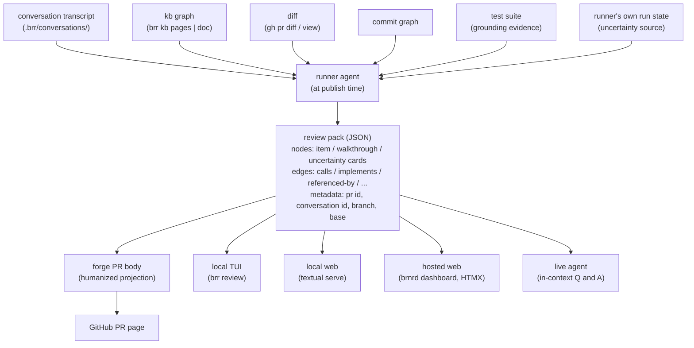

# Design: diffense — kb-first PR review experience

Status: proposed, not yet accepted (drafted 2026-05-28)

diffense (a working name: *diff* + *sense*, the surface that helps a
reviewer make sense of a diff; and *diff* + *defense*, what guards the
merge against shallow review) is brr's answer to a problem the project
feels acutely in its own dogfooding: reviewing a brr-generated PR in a
generic forge diff view is hostile to the way brr actually works,
because roughly half of a typical brr PR's value lives in `kb/` changes
that read poorly as raw diff and well as rendered, cross-linked Markdown.

This page is a design with research-flavoured sections inside. The
cornerstones below are settled enough to design against; the genuinely
open dimensions (pack schema, substrate validation, aesthetic locking,
project boundary) are marked as such and deferred to an implementation
plan after a hand-authored prototype validates the shape against a real
PR.

Companion to:

- [`subject-kb.md`](subject-kb.md) — the kb pattern diffense reads from;
  the lifecycle markers, subject hubs, and decision/design/plan
  separation are diffense's richest structured input.
- [`plan-kb-subcommand.md`](plan-kb-subcommand.md) — the `brr kb` read
  surface (`pages`, `doc`, `log`) that diffense's local viewer composes
  against rather than re-implementing.
- [`design-publish-kernel.md`](design-publish-kernel.md) — the publish
  step diffense's pack generation hangs off: the runner emits the pack
  before publish; the daemon writes the body projection on publish.
- [`plan-brnrd-dashboard-mvp.md`](plan-brnrd-dashboard-mvp.md) — the
  natural home for diffense's future hosted-web rendering target.
- [`design-agent-ergonomics.md`](design-agent-ergonomics.md) — the
  *back* channel (how friction signal leaves the agent for the
  operator). diffense is a *forward* product channel (how the agent's
  understanding of its own change reaches the human reviewer); the two
  share the instinct that an agent should report its own state honestly.

## Problem

Generic PR tools (the GitHub diff view, and the review tools layered on
top of it) assume the unit of review is a code hunk and the reviewer's
job is to read hunks top to bottom. brr breaks both assumptions:

- **~50% of a brr PR is kb.** The kb is Markdown designed to be read
  *rendered* — cross-linked, with lifecycle markers and subject-hub
  context that a raw diff strips away. Reviewing `kb/` changes as
  unified-diff text is reading a graph as if it were a scroll.
- **The reviewer needs the surrounding mental model, not just the
  delta.** "Which subject hub does this land in? What decision does it
  implement? What did the conversation that drove it actually decide?"
  are the questions that make a kb change reviewable, and none of them
  are answerable from the diff alone.
- **Tests already encode user stories but read mechanically.** A good
  integration test is a compressed user story (`setup → action →
  assertion`), but it is written to validate a spec, not to explain
  behaviour, so nobody enjoys reading tests as the explanation.
- **An honest picture of what the change *enables*, and of what the
  agent itself was *uncertain* about, is nowhere.** The diff shows what
  changed; it does not show what becomes possible, nor where the agent
  guessed, assumed, or disagreed while producing it.

The reviewer's real cognitive task is not reading — it is *fitting the
diff into a mental model of the system*, cross-referencing context items
the diff view leaves scattered. Humans are a bottleneck on merging
agentic work, and they are bad at holding lots of context after a single
linear read. The tool should do the vector-packing and cross-referencing
for them, and present the result as a navigable surface, not another
wall of text.

## Target audience

Solo developers through large teams. The audience filter is **depth of
engagement, not team size**: diffense is optimized for a reviewer who
has, or aspires to have, full context of the change — the project owner
who plans features and implements them, and their peers who want to
understand a change rather than rubber-stamp it.

diffense is deliberately *not* optimized for skim-approvers; someone who
only wants to glance and click "approve" will find a shallower tool more
comfortable, and that is fine. The kb-aware advantage applies identically
to a solo dogfooder and to a small team sharing a brr-managed repo —
team size does not change the shape of the surface, only how many people
open it.

## Alternatives briefly considered

The research dimension of this design: shapes weighed and set aside.

- **Plain PR body only, no inspect mode.** A well-structured PR body is
  the v0 surface (see below) and genuinely useful, but stopping there
  leaves the touched-graph and lateral exploration — the part that turns
  reading into navigating — on the table.
- **Forge-hosted artifact (a generated PR comment or gist).** Hosting a
  generated artifact on the forge means PR-comment-shaped UX: no
  interactivity, no rendered-Markdown-with-diff-overlay, drift the moment
  it is written, and a hard coupling to one forge's comment semantics. It
  becomes another wall of text on the PR page — the failure mode we are
  trying to escape.
- **TUI-only viewer.** Power-user-friendly and the natural fit for the
  substrate, but it locks out peers who do not have brr installed.
- **Hosted-web-only viewer.** Requires brnrd and a network round-trip,
  and breaks the dogfooding-on-a-laptop loop that motivates the whole
  thing.
- **A per-team review tool integrated with brr (the Reviewable /
  Graphite shape).** These optimize for a different reviewer profile —
  skim-approval, threaded comment management, stacked-PR mechanics.
  diffense's depth-first, kb-aware shape *complements* those tools rather
  than replacing them; trying to be both produces a worse version of
  each. A team can use Graphite for stack mechanics and diffense for
  understanding the change.

## Reframings the discussion converged on

The design moved through a sequence of reframings, each sharpening the
one before:

- **"Review document" → "review surface."** Not a generated, stored,
  drifting artifact, but a projection over structured state that already
  exists durably in the repo.
- **"Hosted on the forge" → "forge as data source."** The forge hosts
  the PR and its body; the review surface runs locally and reads from it.
- **"Spiraling story" → "progressive disclosure with pre-loaded
  mental-model slots."** The reviewer's mental model has predictable
  slots (what the area does today, what changed, why, what invariants
  were promised, what touches what). A good surface pre-loads them in
  reading order rather than narrating a story.
- **"Linear PR scroll" → "navigable graph of inspection cards."** Every
  change is an item with a stat block, lore, situational comparisons, and
  lateral links to adjacent items.
- **"Tests as spec validation" → "tests as grounding evidence for honest
  user-perspective demos."** Tests stay mechanical for their primary job;
  the agent mines them for the real values that keep a usage demo honest.
- **"One renderer per surface" → "one substrate, multiple rendering
  targets."** The information architecture is defined once; TUI, local
  web, hosted web, and the PR-body projection are all renderings of it.
- **"Agent always confident" → "agent uncertainty as first-class output,
  prominently surfaced."** What the agent was unsure about is among the
  most valuable things a reviewer can read first.

## brr-specific inputs nobody else has

diffense is buildable as a good product *because brr already produces the
structured state a generic tool lacks*. Spec-grade list of inputs and
where each comes from:

- **The diff and PR metadata** — `gh pr view --json` (title, body, base,
  linked issues) and `gh pr diff`.
- **The commit graph between base and head** — the "what" already broken
  into atomic, message-annotated chunks.
- **The conversation that drove the work** — `.brr/conversations/`
  (per-gate-thread logs, covered by
  [`src/brr/conversations.py`](../src/brr/conversations.py)); the source of
  intent and of the agent's in-run reasoning.
- **The kb graph** — `kb/` with lifecycle markers, subject hubs, and the
  decision/design/plan separation; the structure that makes kb changes
  reviewable in context rather than as raw text.
- **The kb read surface** — `brr kb pages` and `brr kb doc <page>` from
  [`plan-kb-subcommand.md`](plan-kb-subcommand.md); diffense composes
  against these rather than rolling its own kb walker.
- **The curated narrative** — [`kb/log.md`](log.md), the episodic record
  of what was done and learned.
- **Commit messages** — the conventional-style "why" that brr's own
  commit contract already enforces.
- **The test suite** — grounding evidence for usage demos, and the
  source for test-add cards' stories.
- **The runner's own state during the run** — the basis for uncertainty
  cards. No other tool has this: only the agent that did the work knows
  where it guessed, assumed, or disagreed.

## Architecture: pack as data, substrate-with-multiple-targets as renderers

Two layers, cleanly separated, so one generation step feeds every
surface and nothing drifts.



- **Pack (data layer).** A structured JSON artifact, language-agnostic.
  Nodes are review cards (item / walkthrough / uncertainty); edges are
  the relations between them; metadata carries PR id, conversation id,
  branch, base, and generation time. Generated by the runner at publish
  time. The pack is the contract — everything else is a renderer.
- **Substrate (component layer).** A single Python component model that
  defines the information architecture: cards, navigation, search,
  per-card reviewer state. Proposed implementation: Textual (see below).
- **Targets (renderers over the substrate / pack).**
  - **TUI (default).** `brr review <pr-url>` runs the substrate as a
    terminal app.
  - **Local web.** `textual serve` exposes the same component model over
    HTTP — same UI, browser-rendered, no second implementation.
  - **Hosted web (future, brnrd).** An HTMX-rendered view in the brnrd
    dashboard ([`plan-brnrd-dashboard-mvp.md`](plan-brnrd-dashboard-mvp.md)).
    A different renderer over the same pack, for peers without a brr
    checkout.
  - **Forge-rendered PR body.** A humanized Markdown projection of the
    pack (see "PR body as the v0 surface"). Useful with zero additional
    UI; works wherever the PR is viewed.
  - **Optional live agent (future).** Reads the pack as grounding context
    to answer follow-up questions about the change.

The payoff of the split: the hardest, most valuable work (assembling the
pack from brr's structured inputs) happens once; adding or improving a
surface never re-touches generation.

## Rendering substrate: Textual proposed, validation pending

**Proposed: [Textual](https://textual.textualize.io/).** brr is already
Python; Textual runs a single component model as a terminal app by
default and exposes the *same* app over the web via `textual serve`. One
codebase, two rendering targets, no drift — which is exactly the
"same-functioning interface in a CLI app and a web app" the design wants.

- **What it gives us.** Keyboard-driven navigation by default; a
  CSS-flavoured styling layer; reactive components; the same widget
  rendering identically in terminal and browser; a small, pure-Python
  runtime footprint consistent with brr's dependency stance
  ([`decision-runtime-dependencies.md`](decision-runtime-dependencies.md)).
- **What it does not give us cleanly.** Rich animated transitions are
  limited by terminal capability; some interactive-graph affordances
  (the touched-graph as a pannable node diagram, slick card-to-card
  transitions) will only be fully realizable in the web target and need
  web-specific work there.
- **Validation gate.** Before locking the substrate choice, a small spike
  renders one *hand-authored* pack as a Textual app and runs it both as a
  TUI and via `textual serve`, to confirm the single-component-model
  promise holds for diffense's card layouts specifically. The spike is a
  future commit, named here, not done now.
- **Fallbacks if Textual does not pan out.** Parallel implementations (a
  Python TUI plus a separate web tool consuming the same pack) or
  HTMX-only (web-first, no TUI). Both increase drift risk and are kept
  only as fallbacks.

## Aesthetic stance: hacker-terminal-text-games leaning, held against the substrate-honest clamp

Leaning, not locked. The substrate *is* a terminal, so the aesthetic
that fits without fighting the medium is dense monospace, keyboard-driven
navigation, a low-key palette, and a terminal-text-game personality. The
web target inherits this rather than reinventing a separate visual
language.

The discipline that keeps this from sliding into cosplay is the
**substrate-honest clamp** (see Discipline): every aesthetic choice must
make the surface more readable, more navigable, or more useful.
Monospace because the substrate is monospace: yes. An ASCII frame around
a card only if it parses the layout faster than whitespace alone would.
Scanlines, terminal-only colour gimmicks, decorative ASCII art: only if
they earn their space. The reference points (the inspection screens in
Souls-likes, Devil May Cry's ability menus) are captivating because every
screen is information-dense and the visual choices serve readability —
not because they pile on effects. The aesthetic is validated alongside
the substrate spike, not locked in this commit.

## Inspect mode: the diffense card model

The core of the product. The review surface is a navigable graph of
*cards*, each an inspectable unit a reviewer can skim in seconds and then
choose to dive into — modelled on a game's item-inspection screen, where
a tightly-bounded card carries a stat block, a short blurb, and lateral
links to related items.

### Three first-class card kinds

- **Item cards** — a typed unit of change: `code-fn-edit`,
  `code-fn-new`, `code-fn-delete`, `kb-page-edit`, `kb-page-new`,
  `kb-page-split`, `lifecycle-flip`, `test-add`, `dep-add`, and so on.
  The kind is a discriminator; the schema differs per kind.
- **Walkthrough cards** — reference an ordered list of item-card ids and
  tell a `setup → action → outcome` story spanning them. A multi-item
  user flow (the BYO-dispatch example below) gets one; a single-item MR
  sometimes gets one too, when the story benefits from framing the item
  card alone cannot carry. Per-item demos and walkthroughs coexist on the
  same MR — emit-iff-honest applies to each independently.
- **Uncertainty cards** — the agent's honest expression of an assumption,
  concern, dilemma, or out-of-scope flag formed during the run. A
  first-class kind, not a footnote (see "Failure modes" below).

### Always-present axes (every card carries these)

- **Identity** — file + symbol + line range, or kb page + section, or
  walkthrough id, or the trigger an uncertainty attaches to.
- **Kind** — the discriminator.
- **Descriptive lore** — what this is, factually (1–2 sentences). For
  `test-add` and walkthrough cards the descriptive lore *is* the story;
  for uncertainty cards it is "what was unclear."
- **Stat block** — the kind-specific load-bearing numbers.
- **Provenance** — which conversation message, which commit, which
  run-state moment produced this.

### Conditional axes (emitted iff honest and load-bearing)

- **Possibility lore** — what becomes possible, what constraint is lifted
  (property-flavoured, never narrative-flavoured).
- **Before/after content** — kind-dependent (a deletion is before-only; a
  new file is after-only).
- **Lateral edges** — `calls` / `called-by` / `implements` (kb design
  page → code) / `referenced-by` (kb cross-link) / `shares-invariant` /
  `part-of-same-decision`; for walkthroughs, the ordered referenced-item
  ids; for uncertainty cards, the related cards.
- **Usage-perspective demo** — when there is a tangible surface change
  worth showing. Textual at v0 (fenced transcripts, before/after caller
  snippets, kb-navigation walks, benchmark output). GIFs are deferred.
- **Exercising-tests link** — which tests anchor the demo / exercise this
  item.
- **Severity** (uncertainty-specific) — `low` / `med` /
  `blocking-for-merge`.
- **Proposed resolution** (uncertainty-specific) — the agent's suggested
  next step, if it has one.
- **Locked-abilities axis** — deferred future direction (the
  grayed-out-but-visible "what this could enable next" register, modelled
  on a game showing locked moves; postponed until the baseline is
  validated).

### Two-axis lore

Borrowed directly from the game-menu reference. Every card answers two
questions, and the second is what makes the surface captivating rather
than merely informative:

- **Descriptive lore** — what the change literally is. *"Hashes payload +
  idempotency key; returns the prior result on collision."*
- **Possibility lore** — what becomes possible / what constraint is
  lifted, stated as a property and never prescribing a use. *"POST /tasks
  is now safely retryable; per-consumer dedup is no longer required."*

The possibility axis lets the reviewer project forward ("with this, I
could…") the way a weapon's stat screen lets a player imagine the next
boss fight. The discipline clamps keep it honest: it states true
properties, it does not narrate how to feel about them.

### Tests as grounding evidence for usage demos

A good integration test is a user story compressed into code. The agent
reads `setup → action → assertion`, extracts the user-flavoured shape,
and writes the usage demo with *real values pulled from the test* rather
than invented ones — which is what keeps the demo honest. Test-add cards
are the special case where the descriptive lore simply *is* the story the
test encodes; walkthrough cards lean hardest on integration tests,
because a cross-cutting flow is precisely what a good integration test
already exercises end to end.

### Worked-example cards

Illustrative mocks (Markdown stand-ins for what the substrate renders).
The shapes, not a schema.

**1. `code-fn-edit` — conditional polling in the GitHub gate.**

```
┌ code-fn-edit ─────────────────────────────────────────────┐
│ id        item:cache.get_with_etag                         │
│ where     src/brr/gates/github/cache.py :: get_with_etag   │
│                                                            │
│ what      Sends If-None-Match with the last stored ETag    │
│           on high-volume GETs; returns the cached body     │
│           unchanged on a 304.                              │
│ enables   Quiet repos stop spending REST budget on polls   │
│           (304s are free); steady-state consumption drops  │
│           ~10x. Self-heals — a stale ETag costs one 200.   │
│                                                            │
│ stats     signature   (path) -> Resp  =>  (path, *, etag)  │
│           callers     3 in repo / 3 updated / 0 unchanged  │
│           error paths +0 (304 is a success branch)         │
│           coverage    +2 tests (was 0 direct)              │
│                                                            │
│ demo      # before: every poll spends budget               │
│           GET /issues/comments      -> 200 (rate -1)       │
│           # after: unchanged repo, no spend                │
│           GET /issues/comments      -> 304 (rate  0)       │
│                                                            │
│ tests     tests/test_github_gate.py::test_etag_304_is_free │
│ edges     called-by polling.poll_once                      │
│           shares-invariant cursor.etags store              │
│ from      commit a1b2c3d · conversation msg #14            │
└────────────────────────────────────────────────────────────┘
```

**2. `lifecycle-flip` (a kb-page-edit subkind) — a plan slice ships.**

```
┌ lifecycle-flip ───────────────────────────────────────────┐
│ id        item:plan-laptop-daemoning.linux-slice           │
│ where     kb/plan-laptop-daemoning.md :: Status            │
│                                                            │
│ what      Marks the Linux systemd slice shipped; the       │
│           macOS LaunchAgent + multi-project runtime stay   │
│           open follow-ups.                                 │
│                                                            │
│ stats     marker      active  =>  partly shipped 2026-05-26│
│           inbound     5 -> 6 (subject-daemon now links it) │
│           siblings    subject-daemon.md  in sync ✓         │
│           successor   n/a (not superseded)                 │
│                                                            │
│ before    Status: accepted 2026-05-26; not started         │
│ after     Status: accepted; Linux systemd slice shipped    │
│                   2026-05-26                                │
│                                                            │
│ (no usage demo — kb-internal change, nothing to run)       │
│ edges     referenced-by subject-daemon.md                  │
│           part-of-same-decision design-config-layout.md    │
│ from      commit d4e5f6a · conversation msg #7             │
└────────────────────────────────────────────────────────────┘
```

The *absence* of a usage demo is deliberate signal: a kb-internal change
has nothing to run, and the card says so rather than faking a demo.

**3. `test-add` — descriptive lore is the story.**

```
┌ test-add ─────────────────────────────────────────────────┐
│ id        item:test.pr_review_summary_event               │
│ where     tests/test_github_gate.py ::                     │
│             test_pr_review_summary_emits_event             │
│                                                            │
│ story     A maintainer leaves a PR review whose summary    │
│           @-mentions the bot. The gate fetches the parent  │
│           review once, sees the mention, and emits a       │
│           pr-review event carrying review id + state       │
│           (APPROVED / CHANGES_REQUESTED / COMMENTED).      │
│                                                            │
│ stats     exercises   polling.poll_once -> pr-review path  │
│           assertion   event shape + dedup via seen ids     │
│           fixtures    shares _gh_stub with 6 gate tests    │
│                                                            │
│ edges     exercises item:polling.detect_pr_review          │
│ from      commit a1b2c3d · conversation msg #19            │
└────────────────────────────────────────────────────────────┘
```

**4. `walkthrough` — a cross-cutting BYO-dispatch flow.**

```
┌ walkthrough ──────────────────────────────────────────────┐
│ id        walk:byo-failover-dispatch                       │
│ title     A subscriber's BYO creds carry a spawn when the  │
│           managed pool is unhealthy                         │
│                                                            │
│ setup     subscriber account, cloud-platform creds present,│
│           managed Fly pool reporting unhealthy             │
│ action    a task event needs a managed-compute spawn       │
│ outcome   dispatcher takes the BYO branch; spawn runs on   │
│           the subscriber's own Fly account; audit records  │
│           spawn_byo (not debit_spawn); wallet untouched    │
│                                                            │
│ steps     1 → item:dispatch.route          (branch on creds)│
│           2 → item:pool.health_check        (unhealthy gate)│
│           3 → item:audit.record_spawn_byo   (wallet bypass) │
│                                                            │
│ grounded  tests/test_dispatch.py::                         │
│             test_byo_when_creds_present_and_pool_unhealthy │
│ from      commits a1b2c3d..d4e5f6a · conversation msgs     │
│           #22-#31                                          │
└────────────────────────────────────────────────────────────┘
```

**5. `uncertainty` (concern subkind) — the agent flags something upstream.**

```
┌ uncertainty · concern ────────────────────────────────────┐
│ id        unc:audit-op-naming-mismatch                     │
│ where     trigger: src/brnrd/audit.py :: OP_SPAWN_BYO       │
│ severity  med  (not blocking, but you may want to fix here)│
│                                                            │
│ unclear   The task asked me to add the BYO wallet-bypass   │
│           audit op. I named it spawn_byo to match          │
│           design-billing.md. But the existing ops in       │
│           audit.py use a debit_/credit_ verb prefix        │
│           (debit_spawn, credit_topup). spawn_byo breaks    │
│           that pattern. I followed the design page over    │
│           the code convention; flagging because you didn't │
│           ask me to reconcile the two.                     │
│                                                            │
│ proposed  Either rename to bypass_spawn_byo for prefix     │
│           consistency, or note in design-billing.md that   │
│           audit-op naming is intentionally domain-led.     │
│                                                            │
│ edges     related item:audit.record_spawn_byo              │
│           related walk:byo-failover-dispatch               │
│ from      conversation msg #27 (where I made the call)     │
└────────────────────────────────────────────────────────────┘
```

### Stats are load-bearing

Every stat answers a question a reviewer actually asks; a stat that does
not is cosmetic and fails the honest clamp. Per-kind starting sets:

- **`code-fn-edit`** — type-signature delta; callers in repo / callers
  updated / callers unchanged; complexity delta; new error paths; test
  coverage delta.
- **`kb-page-edit`** — lifecycle-marker delta; inbound-link-count delta;
  sibling-page sync check; successor-link validity.
- **`test-add`** — production code path exercised; assertion shape;
  fixture sharing.
- **`new-file`** — location justification; inbound-link wiring (does it
  have one yet?); sibling-file pattern adherence.
- **`deletion`** — what replaced it; broken-reference flagging.
- **`uncertainty`** — severity; blast radius (which other cards it
  touches).

The "+/- against equipped item" pattern from the game reference becomes
"delta against the codebase as it currently stands" — the agent that did
the work already has these values in context.

## Reading order: uncertainty cards first

Concrete rule for every renderer and for the PR-body projection:
**uncertainty cards land at the top of the reading order**, before item
cards and walkthroughs. They short-circuit the reviewer's first
question — "what should I scrutinize hardest?" — and are therefore the
highest-value first read.

When there are no uncertainty cards, renderers may collapse the section
entirely. This preserves absence-as-signal: "the agent flagged no
confusions" is itself meaningful information, distinct from a surface
that simply has no place to put them.

## Failure modes: agent uncertainty as first-class output

**Why this exists.** Everything above implicitly assumes the agent
executed a well-scoped task and produced a clean change. Real life is
messier: tasks arrive half-defined, sometimes barely scoped, sometimes
not fully understood by the agent; the agent forms opinions, hits
forks, and makes assumptions mid-run. Suppressing all of that to present
a tidy "everything is fine" surface produces a *dishonest* and brittle
review — the reviewer most needs to know exactly the things a confident
summary hides. So the agent is not only allowed but expected to express
confusion and clarify its WTFs, as first-class cards.

**Four uncertainty subkinds:**

- **assumption** — "your prompt didn't specify X; I assumed Y; here's
  why; flag if wrong."
- **concern** — "Y seems wrong upstream but you didn't ask about it; I
  left it alone; flagging in case you want to fix it here."
- **dilemma** — "I had to choose between A and B; I chose A because of
  constraint Z; here's the path not taken."
- **out-of-scope-flag** — "the task implied Z but I didn't do it because
  I read it as out of scope; you may want it."

**Honesty applies to the agent's own state.** The honest clamp, for
uncertainty cards, means the agent reports its actual run-time state —
where it guessed, assumed, or disagreed — not only facts about the diff.
A pack that *always* reads "everything is clean" cannot be telling the
truth, and a reviewer learns to distrust it. Surfacing uncertainty is
what makes the rest of the surface credible.

**Runner-prompt implication.** The prompt step that produces the pack
instructs the agent to surface uncertainty cards explicitly when
assumptions, concerns, dilemmas, or out-of-scope flags arose, with
examples and severity guidance. No code in this commit; the integration
shape is named in "Where the runner / publish kernel wire in."

## Discipline: the six clamps

The cards must be Occam's-razor sharp, not a place to get lost. Six
clamps gate what the agent emits. A card passes review only if it clears
all six:

1. **Sharp.** Skimmable in 5–10 seconds; every element earns its space
   (a *form* constraint).
2. **Helpful.** Every element load-bears for a reviewer decision (a
   *function* constraint). Distinct from sharp: a card can be small *and*
   useless — that passes sharp but fails helpful; a card can be thorough
   yet every piece earns its weight — that passes helpful. Both are
   required because they fail independently.
3. **Honest.** Every stat answers a real question; possibility lore
   states properties actually true of the change; usage demos use real
   values from real tests or runs; uncertainty cards report the agent's
   actual state.
4. **Non-prescriptive.** Cards describe properties and capabilities; they
   do not prescribe interpretation. *"This dedupes by hashing payload +
   idempotency key"* passes; *"this is the cornerstone of our retry
   strategy"* fails. The reviewer composes meaning from cards; the agent
   that writes them does not. This also guards against the wall-of-text
   relapse — it forbids exactly the "let me explain why this is great"
   prose that bloats reviews.
5. **Emit-iff-honest.** Conditional axes are emitted only when there is
   real material to put there. Possibility lore that would have to be
   aspirational is omitted; a usage demo that would have to be invented
   is omitted; an adjacency that does not exist is omitted. Absence is
   signal — a card admitting "this is internal-only" by emitting no demo
   is more useful than a faked one.
6. **Substrate-honest, not cosplay.** Aesthetic choices earn their space
   by improving readability, navigation, or usefulness — the same
   standard the honest clamp applies to stats.

**The Occam's-razor reading-order test.** A reviewer should reach
"approve / dive deeper / question" within seconds of landing on a card.
If they cannot, the card is doing too much, or the wrong thing.

## PR body as the v0 surface

Before any TUI or web target ships, a well-structured PR body — written
by the runner using a stable template, projected from the pack — is
already a meaningful improvement over today's state, and works wherever
the PR is viewed. v0 surface, not the destination; the inspect-mode UI is
v1.

Template (sections labelled by who fills them — *LLM* for agent-authored
narrative, *mechanical* for deterministic post-processing):

```markdown
## Uncertainties        (LLM; omitted entirely when none)
- [med] audit-op naming breaks the debit_/credit_ prefix pattern …

## Intent               (LLM, grounded in PR body + linked issue)
What this change is for, in the requester's terms.

## Narrative            (LLM)
The spiral: what the area did before, what changed, why, in reading
order. Sharp, non-prescriptive.

## Touched              (mechanical)
- code:  gates/github/cache.py (get_with_etag), polling.py …
- kb:    plan-laptop-daemoning.md (lifecycle flip) …
- tests: test_github_gate.py (+2) …

## Reading order        (mechanical + LLM)
1. Uncertainties  2. <highest-signal cards first>  …

## Deferred / open      (LLM)
What this change deliberately did not do.
```

The Uncertainties section sitting at the very top mirrors the
reading-order rule, so even the forge-only reader who never opens the
inspect UI gets the agent's flagged doubts first.

## Where the live agent fits

Future. Once the pack exists, an in-context follow-up agent can answer
"why this approach?" or "what would break if I removed this check?" with
the pack, the diff, and the kb in context — the "there's a silicon mind
out there we can just ask" loop, attached directly to the review surface.
Out of scope here; named so it is not reinvented later, and constrained
by the same six clamps as the cards.

## Project boundary

The pack format is the contract; renderers can live anywhere. Current
leanings (decided in the implementation plan, not locked here):

- **Pack generation** lives in brr — it is part of the runner's
  publish-time work.
- **The substrate** (the Textual app) lives in brr, with the local viewer
  shipping as part of the package via a `brr review` verb. Open whether
  the code sits in-tree at `src/brr/diffense/` or in its own
  `brr-diffense` extras-installed package; leans in-tree until install
  footprint or maintainer cadence argues otherwise (the same test
  [`decision-monorepo-structure.md`](decision-monorepo-structure.md)
  applies to envs).
- **The hosted view** is a brnrd dashboard renderer over the same pack
  via HTMX, added when subscriber-side dashboard work picks up.

## Where the runner / publish kernel wire in

Deferred to implementation; the shape is named so future slices have an
anchor. diffense hangs off the publish step described in
[`design-publish-kernel.md`](design-publish-kernel.md): the runner emits
the pack as the last step before publish, and the daemon writes the
body projection on publish (via `gh pr edit --body` or the equivalent
forge call). The runner prompt in `src/brr/prompts/` gains a step:
*produce the diffense pack using this schema, under the six clamps;
surface uncertainty cards explicitly when assumptions / concerns /
dilemmas / out-of-scope flags arose; use existing and new tests as
grounding evidence for usage demos and walkthroughs.* No code in this
commit.

## Adjacencies that ship-or-shipped already

- **The `pr-review` event handling** in
  [`src/brr/gates/github/`](../src/brr/gates/github) (shipped 2026-05-27) is
  the gate-side of the review loop: brr *reacts* to a human's review.
  diffense is the human-side counterpart: brr *produces* a surface humans
  can review well. The two close the loop from opposite ends.
- **The `brr kb` plan** ([`plan-kb-subcommand.md`](plan-kb-subcommand.md))
  is composable infrastructure for the local viewer — `kb pages`,
  `kb doc`, and `kb log` are exactly the kb reads diffense needs.
- **The brnrd dashboard plan**
  ([`plan-brnrd-dashboard-mvp.md`](plan-brnrd-dashboard-mvp.md)) is the
  natural home for the hosted-web target.

## Open questions

- **Pack JSON schema.** A discriminated union over item kinds +
  walkthroughs + uncertainty subkinds; finalized in the implementation
  plan after a hand-authored prototype against one real recent brr PR.
- **Substrate technology.** Textual proposed; validated via the spike
  before locking.
- **Aesthetic locking.** Validated alongside the substrate spike.
- **GIFs as a future demo axis.** Textual transcripts cover the v0 case
  at a fraction of the cost (no render pipeline, no drift, diffable);
  revisit GIFs only if transcripts prove insufficient.
- **Locked-abilities axis.** Deferred future direction; postponed until
  the always-vs-conditional baseline is validated.
- **Card-level reviewer state.** Local-only in `.brr/`, or roundtripped
  to forge review comments? Likely local-first, forge-roundtrip optional.
- **Per-item demo vs walkthrough balance.** Both kinds can carry usage
  demos; the heuristic for when a flow earns a walkthrough vs decomposing
  into per-item demos-with-edges is settled empirically during the
  prototype slice.
- **LLM token budget for pack generation.** Bounded by the
  always-vs-conditional split and the six clamps (which push toward small
  cards); revisit on real runs.
- **Live agent on cards.** Cost/value tradeoff addressed when that slice
  is opened; same clamps.
- **Naming.** `diffense` adopted as the working name; the pop-culture
  alternatives `pensieve` (the Harry Potter memory basin — fits "step
  through what happened") and `holocron` (the Star Wars interactive lore
  artifact — fits "inspectable card with lore") were considered and set
  aside as cosplay-leaning next to the mechanical-portmanteau house style
  of `brr` / `brnrd`. The `brr review` verb stays regardless, for
  discoverability. Locking the name is deferred until the spike confirms
  the brand fits the surface.

## Read next

1. [`plan-kb-subcommand.md`](plan-kb-subcommand.md) — the kb read surface
   the local viewer composes against.
2. [`design-publish-kernel.md`](design-publish-kernel.md) — the publish
   step pack generation hangs off.
3. [`subject-kb.md`](subject-kb.md) — the kb pattern diffense's richest
   input comes from.
4. [`plan-brnrd-dashboard-mvp.md`](plan-brnrd-dashboard-mvp.md) — the home
   for the hosted-web target.
5. [`kb/log.md`](log.md) — the 2026-05-27 GitHub-gate design-pass entry
   for the `pr-review` event work diffense complements.

## Lineage

Drafted 2026-05-28, out of a conversation across 2026-05-27 / 2026-05-28
that converged the shape over five refinement passes:

1. **Audience + generation.** Generic power-user persona (a project owner
   who plans and implements); LLM-driven generation by the agent that did
   the work, since it already holds the full task context.
2. **Inspect-mode + the Souls-menu-hangout hypothesis.** Reviews as a
   navigable graph of inspection cards rather than a linear scroll;
   curiosity-driven, explicitly not gamification.
3. **Perceived gain + the sharp/honest/non-prescriptive clamps.** The
   two-axis lore (the possibility axis is the "what this enables"
   projection); the discipline that keeps it from becoming a wall of
   text.
4. **Tests-as-grounding + walkthrough kind + parallel CLI/web rendering +
   promotion to design.** Tests as honest evidence for usage demos;
   walkthroughs for cross-cutting flows; one substrate, multiple targets
   (Textual); research promoted to design once the cornerstones held.
5. **Small-team audience + the helpful clamp + the `diffense` name +
   uncertainty cards as first-class.** Audience widened from solo to
   teams; the helpful clamp split from sharp; the project named; agent
   uncertainty made a first-class, top-of-reading-order card kind.
