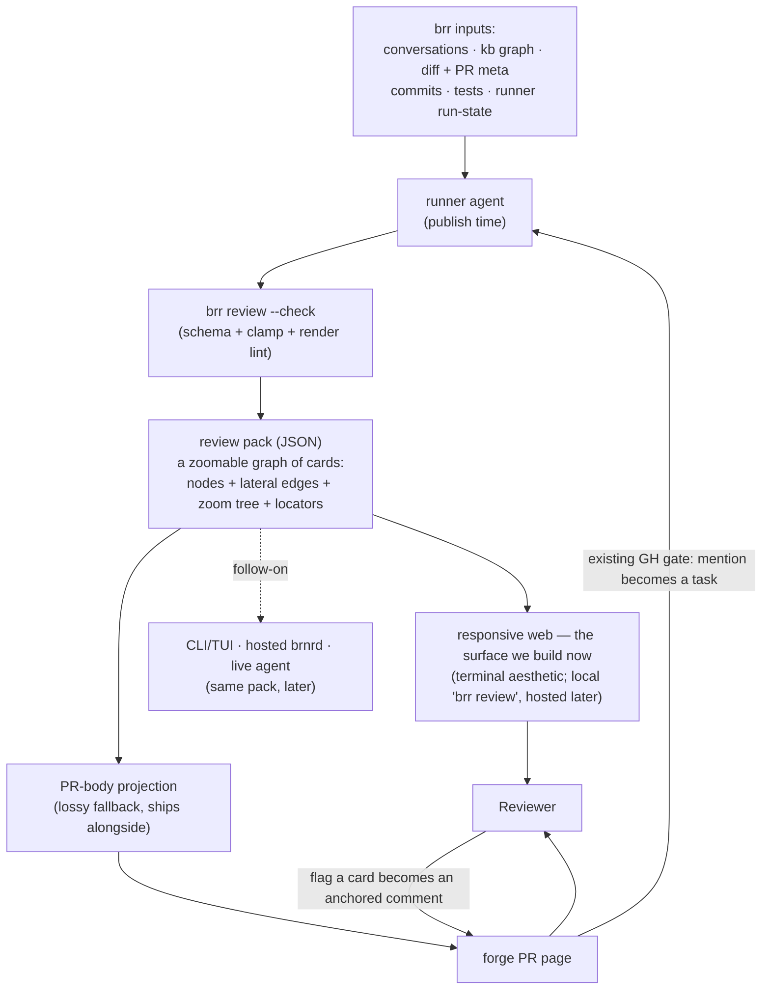
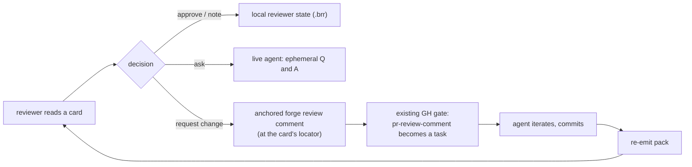

# Design: diffense — kb-first PR review experience

Status: proposed, not yet accepted (drafted 2026-05-28; reshaped 2026-05-29, passes 6–8)

diffense (a working name: *diff* + *sense*, the surface that helps a
reviewer make sense of a diff; and *diff* + *defense*, what guards the
merge against shallow review) is brr's answer to a problem the project
feels acutely in its own dogfooding: reviewing a brr-generated PR in a
generic forge diff view is hostile to the way brr actually works,
because roughly half of a typical brr PR's value lives in `kb/` changes
that read poorly as raw diff and well as rendered, cross-linked Markdown.

This page is a design with research-flavoured sections inside. The
cornerstones below are settled enough to design against; the genuinely
open dimensions (pack schema, the graph / inter-card navigation and the
code-rendering-at-a-locator UI, pack transport, aesthetic locking) are
marked as such and deferred to an implementation plan after a
hand-authored prototype validates the shape against a real PR.

Companion to:

- [`subject-kb.md`](subject-kb.md) — the kb pattern diffense reads from;
  the lifecycle markers, subject hubs, and decision/design/plan
  separation are diffense's richest structured input.
- [`plan-kb-subcommand.md`](plan-kb-subcommand.md) — the `brr kb` read
  surface (`pages`, `doc`, `log`) that diffense's renderers compose
  against rather than re-implementing.
- [`design-publish-kernel.md`](design-publish-kernel.md) — the publish
  step diffense's pack generation hangs off: the runner emits the pack
  before publish; the daemon writes the body projection on publish.
- [`design-github-gate-vs-brnrd-app.md`](design-github-gate-vs-brnrd-app.md)
  — the gate-side review-event boundary; diffense's feedback loop rides
  the `pr-review-comment` handling described there.
- [`plan-brnrd-dashboard-mvp.md`](plan-brnrd-dashboard-mvp.md) — the
  home for diffense's hosted web renderer (and the answer to mobile
  review).
- [`design-agent-ergonomics.md`](design-agent-ergonomics.md) — the
  *back* channel (agent friction → operator). diffense is the *forward*
  product channel (the agent's understanding of its own change → the
  human reviewer). Shared source, split audience — see "Relationship to
  the ergo proxy."

## Problem

Generic PR tools (the GitHub diff view, and the review tools layered on
top of it) assume the unit of review is a code hunk and the reviewer's
job is to read hunks top to bottom. brr breaks both assumptions:

- **~50% of a brr PR is kb.** The kb is Markdown designed to be read
  *rendered* — cross-linked, with lifecycle markers and subject-hub
  context that a raw diff strips away. Reviewing `kb/` changes as
  unified-diff text is reading a graph as if it were a scroll.
- **The reviewer needs the surrounding mental model, not just the
  delta.** "Which subject hub does this land in? What decision does it
  implement? What did the conversation that drove it actually decide?"
  are the questions that make a kb change reviewable, and none of them
  are answerable from the diff alone.
- **Tests already encode user stories but read mechanically.** A good
  integration test is a compressed user story (`setup → action →
  assertion`), but it is written to validate a spec, not to explain
  behaviour, so nobody enjoys reading tests as the explanation.
- **An honest picture of what the change *enables*, and of what the
  agent itself was *uncertain* about, is nowhere.** The diff shows what
  changed; it does not show what becomes possible, nor where the agent
  guessed, assumed, or disagreed while producing it.

The reviewer's real cognitive task is not reading — it is *fitting the
diff into a mental model of the system*, cross-referencing context items
the diff view leaves scattered. Humans are a bottleneck on merging
agentic work, and they are bad at holding lots of context after a single
linear read. The tool should do the vector-packing and cross-referencing
for them, and present the result as a navigable surface, not another
wall of text.

## Target audience

Solo developers through large teams. The audience filter is **depth of
engagement, not team size**: diffense is optimized for a reviewer who
has, or aspires to have, full context of the change — the project owner
who plans features and implements them, and their peers who want to
understand a change rather than rubber-stamp it.

diffense is deliberately *not* optimized for skim-approvers; someone who
only wants to glance and click "approve" will find a shallower tool more
comfortable, and that is fine. The kb-aware advantage applies identically
to a solo dogfooder and to a small team sharing a brr-managed repo —
team size does not change the shape of the surface, only how many people
open it.

## Alternatives briefly considered

The research dimension of this design: shapes weighed and set aside.

- **Plain PR body only, no inspect mode.** A structured PR body is a
  genuinely useful *lossy fallback* (see "PR body as a lossy
  projection"), but anchoring the *whole design* on a text-first surface
  under-shapes the product — it leaves the zoomable graph, the locators,
  and the feedback loop on the table and risks the full shape never
  forming. The PR body is a projection of the pack, not the thing we
  design around.
- **Forge-hosted artifact (a generated PR comment or gist).** Hosting a
  generated artifact on the forge means PR-comment-shaped UX: no
  interactivity, no zoom, drift the moment it is written, and a hard
  coupling to one forge's comment semantics.
- **TUI-only viewer.** Power-user-friendly, but it locks out peers
  without brr installed and is the wrong surface for phone review (see
  "Surfaces and what to build first").
- **Hosted-web-only viewer.** Requires brnrd / network; breaks
  dogfooding on a laptop with no connection.
- **A per-team review tool integrated with brr (the Reviewable /
  Graphite shape).** These optimize for a different reviewer profile —
  skim-approval, threaded comment management, stacked-PR mechanics.
  diffense's depth-first, kb-aware shape *complements* those tools rather
  than replacing them; a team can use Graphite for stack mechanics and
  diffense for understanding the change. Trying to be both produces a
  worse version of each.

## Reframings the discussion converged on

Each reframing moves a noun from a heavyweight thing-to-build into a
projection over state brr already has, or sharpens the interaction model:

- **"Review document" → "review surface."** A projection over structured
  state, not a separately-authored, drifting document.
- **"Hosted on the forge" → "forge as data source."** The forge hosts the
  PR; the review surface reads from it.
- **"Spiraling story" → "progressive disclosure with pre-loaded
  mental-model slots."** The reviewer's model has predictable slots; a
  good surface pre-loads them in reading order.
- **"Linear PR scroll" → "a *zoomable* graph of inspection cards."** Two
  navigation axes — lateral (peers) and zoom (summary → detail → ground
  truth). This is the structural centerpiece (see "The card model").
- **"Tests as spec validation" → "tests as grounding evidence for honest
  user-perspective demos."**
- **"One renderer per surface" → "one pack, multiple renderers."** The
  *pack* is the contract; renderers are cheap relative to it. (The
  earlier "one Textual substrate for TUI + web" idea is dropped: the
  near-term surface is a single responsive web renderer; a CLI/TUI is a
  follow-up over the same pack — see "Renderers.")
- **"Agent always confident" → "agent uncertainty as first-class output,
  prominently surfaced."**
- **"Static read-only surface" → "a read surface wired into the existing
  feedback loop."** A reviewer who spots something flags a card; that
  becomes a forge comment; the existing gate turns it into a task. See
  "The feedback loop."

## brr-specific inputs nobody else has

diffense is buildable as a good product *because brr already produces the
structured state a generic tool lacks*:

- **The diff and PR metadata** — `gh pr view --json` + `gh pr diff`.
- **The commit graph between base and head** — the "what" already broken
  into atomic, message-annotated chunks.
- **The conversation that drove the work** — `.brr/conversations/`
  (per-gate-thread logs, covered by
  [`src/brr/conversations.py`](../src/brr/conversations.py)); the source
  of intent and of the agent's in-run reasoning.
- **The kb graph** — `kb/` with lifecycle markers, subject hubs, and the
  decision/design/plan separation.
- **The kb read surface** — `brr kb pages` and `brr kb doc <page>` from
  [`plan-kb-subcommand.md`](plan-kb-subcommand.md).
- **The curated narrative** — [`kb/log.md`](log.md).
- **Commit messages** — the conventional-style "why" brr's commit
  contract enforces.
- **The test suite** — grounding evidence for usage demos.
- **The runner's own state during the run** — the basis for uncertainty
  cards. No other tool has this: only the agent that did the work knows
  where it guessed, assumed, or disagreed.

## Architecture: pack as data, renderers as targets

Two layers, cleanly separated, so the data outlives any one renderer and
one generation step feeds every surface.



- **Pack (data layer).** A structured JSON artifact, language-agnostic.
  Nodes are cards (item / walkthrough / uncertainty); each node carries a
  **zoom tree** (gloss → detail → ground-truth leaf) and **locators**
  (resolvable references into code / kb / diff); edges are lateral
  relations; metadata carries PR id, conversation id, branch, base, and
  generation time. Generated by the runner at publish time. The pack is
  the contract — everything else is a renderer.
- **Renderers (targets over the pack).**

| Renderer | Surface | Tenancy | Status |
| --- | --- | --- | --- |
| Responsive web | terminal-aesthetic HTML; `brr review` serves it locally | self-hosted (local; LAN/tunnel for phone) | **the surface we build now** |
| PR-body projection | humanized Markdown in the PR body | any forge reader | lossy fallback, ships alongside |
| CLI / TUI | `brr review` in the terminal | self-hosted | follow-up, same pack |
| Hosted web | brnrd-dashboard renderer | hosted | future (after brnrd exists) |
| Live agent | in-context Q&A over the pack | both | future |

The payoff of the split: the hardest, most valuable work (assembling the
pack from brr's structured inputs) happens once; adding or improving a
renderer never re-touches generation. Near term that work feeds exactly
one real renderer (web) plus the free PR-body fallback — everything else
is a later consumer of the same pack.

## Renderers: one web surface now, CLI/TUI and hosted later

The plan went through a Textual-substrate phase (one component model
serving a TUI and a `textual serve` web target). The mobile requirement
already weakened it — `textual serve` is a terminal emulator in the
browser, the wrong surface on a phone — and the decision is now cleaner:
**drop the near-term TUI entirely and build a single responsive web
renderer.** A CLI/TUI is a follow-up over the same pack once the web
shape is proven.

This *resolves* the substrate-split tension rather than carrying it.
Consequences:

- **One renderer to build:** responsive HTML, mobile-friendly, no app
  to install (a PWA at most — explicitly *not* a native app). Served
  locally by `brr review` (an ephemeral local server); reachable from a
  phone over LAN or a tunnel until the hosted brnrd renderer exists.
- **The terminal aesthetic lives in the web renderer**, not in an actual
  terminal: ascii/terminal-*looking* cards (see "Aesthetic" and
  "Rendering the zoom"). We keep the hacker-terminal feel without paying
  for a second rendering stack.
- **Self-hosting tradeoff, accepted.** A local web tool is slightly more
  friction than a TUI would have been for a terminal-native self-hoster
  (start a server, open a browser, vs. a pane in the terminal). It is
  doable, it serves phone review and the future hosted path with the
  same code, and the CLI/TUI follow-up closes the terminal-native gap
  later. Worth the trade.
- **Keep it light.** diffense is being built *before* brnrd exists and
  must not depend on it or get buried under another project's
  complexity. The web renderer is a small, self-contained app over the
  pack with minimal dependencies; brnrd later renders the same pack
  without diffense having to know brnrd is there.

A small spike still validates the card / zoom / navigation model against
one hand-authored pack before the renderer is locked.

## Aesthetic stance: hacker-terminal-text-games leaning, held against the substrate-honest clamp

A leaning, not a lock — and now expressed entirely in the web renderer,
since there is no near-term terminal target. The direction still feels
right: dense, information-first layout; ascii/terminal-*looking* cards
(monospace, line-drawn frames, low-key palette); a terminal-text-game
personality. The web medium carries the *look and spirit* (density,
glanceable stat blocks, lateral exploration) while honouring touch and
responsive reflow — terminal-flavoured, not a literal terminal cosplayed
on a phone.

The **substrate-honest clamp** (see Discipline) keeps this from sliding
into cosplay: every aesthetic choice earns its space by improving
readability, navigation, or usefulness. The reference points (the
inspection screens in Souls-likes, Devil May Cry's ability menus) are
captivating because every screen is information-dense and the visual
choices serve readability — not because they pile on effects. Validated
alongside the renderer spike, not locked here.

## The card model: a zoomable graph

The core of the product. The review surface is a **graph of cards with
two navigation axes**:

- **Lateral** — typed edges to related peer cards (`calls`, `implements`,
  `referenced-by`, `shares-invariant`, `part-of-same-decision`, …).
- **Zoom** — each card descends from a one-line **gloss** through
  progressively more detailed **summary levels** to a **ground-truth
  leaf**: the actual rendered kb page, the raw diff hunk, or the code at
  a locator. Summary levels are LLM-authored and clamp-gated; **the leaf
  is mechanical** — the real artifact, pulled deterministically.

This is the spiral made concrete: you skim the gloss, and you can descend
toward ground truth exactly as far as you need, on any card. Two
properties fall out and matter:

- **Honesty is structural.** Because every card bottoms out at the real
  diff / file / rendered page, no summary can hide the truth — you can
  always zoom past it. The summary earns trust by being checkable.
- **Token cost is bounded.** Summaries are small and LLM-authored; leaves
  are not generated (they are the existing diff/file). The pack carries
  summaries + locators, not regenerated copies of the code.

### Three first-class card kinds

- **Item cards** — a typed unit of change: `code-fn-edit`,
  `code-fn-new`, `code-fn-delete`, `code-module-split` /
  `code-restructure`, `code-move`, `kb-page-edit`, `kb-page-new`,
  `kb-page-split`, `lifecycle-flip`, `test-add`, `dep-add`, and so on.
  The kind is a discriminator; the schema differs per kind. (The
  `code-module-split` / `code-move` kinds were added after the
  [PR #64 prototype](diffense-prototype-pr64.md) showed a 1052-line
  file → 12-module split had no honest home among the per-function
  kinds — a delete-plus-twelve-new would lie about what happened.)
- **Walkthrough cards** — a **composite card**: its gloss is a
  `setup → action → outcome` story; zooming reveals its *ordered member
  cards*. This is "a card containing a group of cards" — the zoom axis
  applied to a story. It renders as a plain story at gloss level and as
  an expandable group when zoomed, so it serves both the quick read and
  the deep dive. A multi-item flow gets one; a single-item change
  sometimes does too, when the story needs framing the item card alone
  cannot carry.
- **Uncertainty cards** — the agent's honest expression of an assumption,
  concern, dilemma, out-of-scope flag, or follow-up formed during the
  run. A first-class kind (see "Failure modes").

Plus a **summary card** — one per pack, the orienting header. It is not
a change card; it is the pack's on-ramp, and it always renders first (see
"Reading order").

#### The kind set is an open core, not a closed enum

A small set of well-known change-card kinds (above) is special-cased by
renderers and `--check`; beyond them the agent may **declare a `custom`
kind** inline — a card that names its own kind, carries a one-line "why
this needed its own shape," and degrades to a generic card in any
renderer. Two things keep this honest rather than chaotic: a custom card
still obeys the always-present axes and the six clamps, and the agent is
expected to **raise the gap as a meta uncertainty card** ("I emitted a
custom `X` because the core lacked it — consider promoting it"; see
"Failure modes → Meta uncertainty"). Recurring custom kinds get promoted
into the core. `code-module-split` is the first worked example: it began
as a provisional kind in the [PR #64 prototype](diffense-prototype-pr64.md)
and was promoted here. The taxonomy improves from real use — the way the
kb does — not from an up-front enum nobody can extend.

### Always-present axes (every card carries these)

- **Identity + locator** — what this is (file + symbol + line range, kb
  page + section, walkthrough id, or an uncertainty trigger) *and* a
  resolvable locator: a commit-pinned forge permalink
  (`…/blob/<sha>/<path>#L…`) plus a local `path:line`. Rich renderers
  open the locator inline (the zoom leaf); the PR-body and minimal
  renderers link out to it. **Any card that mentions a code item carries
  a locator to it** — no dead references.
- **Kind** — the discriminator.
- **Gloss (descriptive lore)** — what this is, in plain language (1–2
  sentences). For `test-add` and walkthrough cards the gloss *is* the
  story; for uncertainty cards it is the worry stated in one plain
  sentence. **The gloss leads.** Whatever the kind, the first
  human-readable line a renderer paints is the gloss; the identity, the
  exact locator, and any formal tension notation descend *below* it. (The
  PR #64 prototype's first uncertainty render violated this — it opened on
  `id` / `tension: bounded cursor state ⟂ exactly-once delivery` /
  `where: polling.py:283` before saying in words what the worry actually
  was. The fix is to ease the reader in with the plain sentence first,
  then drop to the specifics. It is easy to get backwards precisely
  because the agent already has the specifics in hand.)
- **Zoom tree** — the ordered summary levels down to the ground-truth
  leaf (the levels themselves vary by kind; see "Zoom levels").
- **Stat block** — the kind-specific load-bearing numbers.
- **Provenance** — which conversation message, which commit, which
  run-state moment produced this.

### Conditional axes (emitted iff honest and load-bearing)

- **Possibility lore** — what becomes possible / what constraint is
  lifted (property-flavoured, never narrative-flavoured).
- **Before/after content** — kind-dependent (a deletion is before-only).
- **Lateral edges** — peer relations; for walkthroughs, the ordered
  member-card ids; for uncertainty cards, the related cards.
- **Usage-perspective demo** — when there is a tangible surface change
  worth showing. Text-based at v0 (fenced transcripts, before/after
  caller snippets, kb-navigation walks, benchmark output). GIFs deferred.
- **Exercising-tests link** — which tests anchor the demo / exercise this
  item.
- **Tension references** (uncertainty-specific) — pointers to the
  conflicting parts: most often the input prompt span, but also a code
  locator, a kb claim, or another card. See "Failure modes."
- **Severity** (uncertainty-specific) — `low` / `med` /
  `blocking-for-merge`.
- **Proposed resolution** (uncertainty-specific).
- **Locked-abilities axis** — deferred future direction.

### Zoom levels (progressive disclosure, per kind)

The zoom tree is what turns the kb summary-tree idea into a general
mechanic. Concretely, by kind:

- **`kb-page-edit`** — L0 gloss ("what changed + lifecycle delta") → L1
  per-section summaries of what moved → L2 rendered before/after of each
  changed section → leaf: the full rendered page (and the raw diff as a
  sibling leaf). This is the "tree of summarized info" descending into
  the actual file change.
- **`code-fn-edit`** — L0 gloss + signature delta → L1 behaviour summary
  + stat block → leaf: the diff hunk, and the function at its locator
  (opened inline in rich renderers).
- **walkthrough** — L0 story → L1 the ordered member glosses → descend
  into each member card's own zoom tree.

Leaves are always the real artifact. The agent authors L0..Ln; the leaf
is resolved mechanically from the diff / repo / locator.

### Rendering the zoom: nested heading-bar stacks (web)

The concrete interaction the web renderer is built around. Cards are
loosely rendered, terminal/ascii-*looking* blocks. **Opening a nested
card collapses its parent to just its full-width heading bar**, and this
**nests indefinitely**: as you descend, the screen becomes a stack of
parent heading bars (the path from root to where you are) above the card
you are currently inspecting. The stack *is* the breadcrumb — each bar is
a click back up a level, so depth never loses your place. This keeps the
glance/dive rhythm physical: one bar = one level of context held, the
focused card gets the room.

Two parts of the interaction model are **genuinely open** (flagged so the
spike resolves them rather than guessing now):

- **Inter-card / graph navigation** — moving *laterally* between
  same-level cards and along edges (the graph view, "jump to a peer")
  versus the vertical zoom stack. How the lateral axis is presented
  alongside the heading-bar stack is unresolved.
- **Code rendering at a locator** — what a code leaf actually looks like
  when opened (inline syntax-highlighted block, side-by-side diff, a jump
  out to the forge permalink). The locator data is settled; its rendering
  is not.

### Two-axis lore

Borrowed from the Souls / DMC menu framing: every card answers two
questions, and the second is what makes the surface captivating rather
than merely informative.

- **Descriptive lore** — what the change literally is. *"Hashes payload +
  idempotency key; returns the prior result on collision."*
- **Possibility lore** — what becomes possible / what constraint is
  lifted, stated as a property and never prescribing a use. *"POST /tasks
  is now safely retryable; per-consumer dedup is no longer required."*

The possibility axis lets the reviewer project forward ("with this, I
could…") the way a weapon's stat screen lets a player imagine the next
fight — an honest *perceived gain*, not a recommendation.

### Tests as grounding evidence for usage demos

A good integration test is a user story compressed into code. The agent
reads `setup → action → assertion`, extracts the user-flavoured shape,
and writes the usage demo with *real values pulled from the test* rather
than invented ones — which keeps the demo honest. Test-add cards are the
special case where the gloss *is* the story the test encodes; walkthrough
cards lean hardest on integration tests, because a cross-cutting flow is
precisely what a good integration test already exercises end to end.

### Worked-example cards

Illustrative mocks (Markdown stand-ins for what a renderer paints; the
shapes, not a schema). Each emits only the conditional axes that are
honest and load-bearing for it.

**1. `code-fn-edit` — conditional polling in the GitHub gate (with locator + zoom).**

```
┌ code-fn-edit ─────────────────────────────────────────────┐
│ id        item:cache.get_with_etag                         │
│ where     src/brr/gates/github/cache.py :: get_with_etag   │
│ locator   github …/blob/a1b2c3d/src/brr/gates/github/      │
│           cache.py#L40-L78   ·   local cache.py:40         │
│                                                            │
│ what      Sends If-None-Match with the last stored ETag    │
│           on high-volume GETs; returns the cached body     │
│           unchanged on a 304.                              │
│ enables   Quiet repos stop spending REST budget on polls   │
│           (304s are free); steady-state consumption drops  │
│           ~10x. Self-heals — a stale ETag costs one 200.   │
│                                                            │
│ stats     signature   (path) -> Resp  =>  (path, *, etag)  │
│           callers     3 in repo / 3 updated / 0 unchanged  │
│           error paths +0 (304 is a success branch)         │
│           coverage    +2 tests (was 0 direct)              │
│                                                            │
│ zoom  ▸L1 behaviour summary  ▸leaf diff hunk  ▸leaf code   │
│ demo      # before: every poll spends budget               │
│           GET /issues/comments      -> 200 (rate -1)       │
│           # after: unchanged repo, no spend                │
│           GET /issues/comments      -> 304 (rate  0)       │
│                                                            │
│ tests     tests/test_github_gate.py::test_etag_304_is_free │
│ edges     called-by polling.poll_once                      │
│           shares-invariant cursor.etags store              │
│ from      commit a1b2c3d · conversation msg #14            │
└────────────────────────────────────────────────────────────┘
```

**2. `kb-page-edit` + `lifecycle-flip` — a plan slice ships (zoom tree; no demo).**

```
┌ kb-page-edit · lifecycle-flip ────────────────────────────┐
│ id        item:plan-laptop-daemoning.linux-slice           │
│ where     kb/plan-laptop-daemoning.md :: Status            │
│ locator   github …/blob/d4e5f6a/kb/plan-laptop-daemoning.md│
│                                                            │
│ what      Marks the Linux systemd slice shipped; macOS +   │
│           multi-project runtime stay open follow-ups.      │
│                                                            │
│ stats     marker     active => partly shipped 2026-05-26   │
│           inbound    5 -> 6 (subject-daemon now links it)  │
│           siblings   subject-daemon.md  in sync ✓          │
│           successor  n/a (not superseded)                  │
│                                                            │
│ zoom  ▸L1 per-section summary  ▸L2 rendered before/after   │
│       ▸leaf full rendered page  ▸leaf raw diff             │
│ (no usage demo — kb-internal change, nothing to run)       │
│ edges     referenced-by subject-daemon.md                  │
│           part-of-same-decision design-config-layout.md    │
│ from      commit d4e5f6a · conversation msg #7             │
└────────────────────────────────────────────────────────────┘
```

The *absence* of a usage demo is deliberate signal: a kb-internal change
has nothing to run, and the card says so rather than faking a demo.

**3. `test-add` — gloss is the story.**

```
┌ test-add ─────────────────────────────────────────────────┐
│ id        item:test.pr_review_summary_event               │
│ where     tests/test_github_gate.py ::                     │
│             test_pr_review_summary_emits_event             │
│ story     A maintainer leaves a PR review whose summary    │
│           @-mentions the bot. The gate fetches the parent  │
│           review once, sees the mention, and emits a       │
│           pr-review event carrying review id + state.      │
│ stats     exercises   polling.poll_once -> pr-review path  │
│           assertion   event shape + dedup via seen ids     │
│           fixtures    shares _gh_stub with 6 gate tests    │
│ edges     exercises item:polling.detect_pr_review          │
│ from      commit a1b2c3d · conversation msg #19            │
└────────────────────────────────────────────────────────────┘
```

**4. `walkthrough` — a composite card (gloss = story; zoom = member cards).**

```
┌ walkthrough ──────────────────────────────────────────────┐
│ id        walk:byo-failover-dispatch                       │
│ title     A subscriber's BYO creds carry a spawn when the  │
│           managed pool is unhealthy                         │
│                                                            │
│ setup     subscriber account, cloud-platform creds present,│
│           managed Fly pool reporting unhealthy             │
│ action    a task event needs a managed-compute spawn       │
│ outcome   dispatcher takes the BYO branch; spawn runs on   │
│           the subscriber's own Fly account; audit records  │
│           spawn_byo (not debit_spawn); wallet untouched    │
│                                                            │
│ zoom ▸ members (ordered) — each opens its own card:        │
│   1 → item:dispatch.route          (branch on creds)       │
│   2 → item:pool.health_check        (unhealthy gate)       │
│   3 → item:audit.record_spawn_byo   (wallet bypass)        │
│                                                            │
│ grounded  tests/test_dispatch.py::                         │
│             test_byo_when_creds_present_and_pool_unhealthy │
│ from      commits a1b2c3d..d4e5f6a · conversation msgs     │
│           #22-#31                                          │
└────────────────────────────────────────────────────────────┘
```

**5. `uncertainty` (concern) — references the tension explicitly.**

```
┌ uncertainty · concern ────────────────────────────────────┐
│ id        unc:audit-op-naming-mismatch                     │
│ severity  med  (not blocking, but you may want to fix here)│
│ tension   design-billing.md  ⟂  src/brnrd/audit.py         │
│           (design page says spawn_byo; the code's existing │
│            ops use a debit_/credit_ verb prefix)           │
│                                                            │
│ unclear   I added the BYO wallet-bypass audit op and named │
│           it spawn_byo to match design-billing.md, which   │
│           breaks the debit_/credit_ prefix the other ops   │
│           use. I followed the design page over the code    │
│           convention; flagging because you didn't ask me   │
│           to reconcile the two.                            │
│ proposed  Rename to bypass_spawn_byo for prefix consistency│
│           OR note in design-billing.md that audit-op naming│
│           is intentionally domain-led.                     │
│ edges     related item:audit.record_spawn_byo              │
│           related walk:byo-failover-dispatch               │
│ from      conversation msg #27 (where I made the call)     │
└────────────────────────────────────────────────────────────┘
```

**6. `uncertainty` (follow-up) — near-future work for max value, held out of scope.**

```
┌ uncertainty · follow-up ──────────────────────────────────┐
│ id        unc:byo-needs-cred-rotation                      │
│ severity  low  (this change is complete; this is next)     │
│ tension   task scope  ⟂  full user value                   │
│           (the task asked only for the dispatch branch)    │
│                                                            │
│ unclear   BYO dispatch works, but a subscriber whose cloud │
│           token expires gets a hard spawn failure with no  │
│           rotation path. To make BYO actually dependable   │
│           the near-future work is a cred-health probe +    │
│           a re-auth nudge on the dashboard. Out of scope   │
│           here; flagging so it doesn't get lost.           │
│ proposed  File as a follow-up; it's ~a day and it's what   │
│           turns BYO from "works" into "trustworthy."       │
│ edges     related walk:byo-failover-dispatch               │
│ from      conversation msg #33                             │
└────────────────────────────────────────────────────────────┘
```

### Stats are load-bearing

Every stat answers a question a reviewer actually asks; a stat that does
not is cosmetic and fails the honest clamp. Per-kind starting sets:

- **`code-fn-edit`** — type-signature delta; callers in repo / updated /
  unchanged; complexity delta; new error paths; test-coverage delta.
- **`kb-page-edit`** — lifecycle-marker delta; inbound-link-count delta;
  sibling-page sync check; successor-link validity.
- **`test-add`** — production code path exercised; assertion shape;
  fixture sharing.
- **`new-file`** — location justification; inbound-link wiring;
  sibling-file pattern adherence.
- **`deletion`** — what replaced it; broken-reference flagging.
- **`uncertainty`** — severity; blast radius (which other cards it
  touches).

The "+/- against equipped item" pattern from the game reference becomes
"delta against the codebase as it currently stands" — the agent that did
the work already has these values in context.

## Reading order: orient, surface concerns, then explore

Earlier drafts said bluntly "uncertainty cards first." Pressure-testing
the prototype refined that: a reviewer dropped *straight* into the
sharpest, most specific concern (`sorted(seen)[-_SEEN_CAP:]`, ×7) with no
frame is jarring, even when the concern is exactly right. The surface
needs a beat of orientation before the scrutiny — but concerns must still
be surfaced early, not buried. The order that satisfies both:

1. **A single summary card opens the pack** — the on-ramp / header (see
   below). Five seconds; it names what the change *is* and points at the
   concerns.
2. **Uncertainty cards come next** — still the first *substantive* read,
   still answering "what should I scrutinize hardest?", and pointed at by
   the summary so nothing is hidden behind the orientation.
3. **Walkthroughs and item cards follow** — the change itself, explored
   at whatever depth the reviewer chooses.

Why orient before scrutinize: you cannot judge *what to scrutinize
hardest* without a five-second *what is this even*. The summary is the
frame that makes the first concern legible; it is deliberately tiny, and
it carries the concern count and severity, so surfacing-early is
preserved — the concern is one glance away, just not the literal first
pixels with no context.

### The summary card (the header — context, not just counts)

One per pack, always first. It answers "what is this PR, in shape?" The
"there should be a header here" instinct and the "PR stats, but they're
too detailed and contextless" instinct resolve to the same card: numbers
in service of a shape, never raw numbers alone.

- **What it's for** — one paragraph of plain intent.
- **The shape** — how many cards; the story arcs the change splits into
  (e.g. *fix · refactor · feature*); the surface area (which subsystems,
  which kb pages).
- **The risk pointer** — "N concerns (M blocking / med) — read next," so
  the reviewer knows up front whether this is a rubber-stamp or a
  scrutinize.

Raw `+/−` and file counts stay available (a zoom level, or a secondary
line) but are never the headline: "23 files, 2642+/1221−" is precise and
tells a reviewer nothing about what to *do*. The summary turns that into
"three braided arcs across the GitHub gate plus one new kb design page;
two concerns, one med." When there are no uncertainty cards, the summary
says so — absence-as-signal preserved, and the uncertainty section
collapses.

## Failure modes: agent uncertainty as first-class output

**Why this exists.** The rest of the card model implicitly assumes the
agent executed a well-scoped task successfully. Real life is messier:
tasks arrive half-defined, sometimes barely scoped, sometimes not fully
understood; the agent forms opinions, hits forks, and makes assumptions
mid-run. Suppressing all of that to present a tidy "everything is fine"
surface produces a *dishonest* and brittle review. So the agent is not
only allowed but expected to express confusion and clarify its WTFs, as
first-class cards.

**Uncertainty cards reference the tension.** Every uncertainty card
points at the *conflicting parts* via tension references — the surface
should show *what is in tension with what*, not just that the agent felt
unsure. The most common reference is **the input prompt**: the task was
too shallow, it carried an implication that wasn't true, or the actual
code contradicted the mental model the prompt assumed. Other references:
a code locator, a kb claim, or another card. Uncertainty can also attach
to **the agent's own choice** that raised tension during execution — not
only external confusion.

**Subkinds:**

- **assumption** — "your prompt didn't specify X; I assumed Y; here's
  why; flag if wrong." (tension: prompt ⟂ reality)
- **concern** — "Y seems wrong upstream but you didn't ask; I left it;
  flagging in case you want to fix it here." (Card 5 above.)
- **dilemma** — "I had to choose between A and B; chose A because of
  constraint Z; here's the path not taken." (tension: the agent's own
  choice ⟂ a viable alternative)
- **out-of-scope-flag** — "the task implied Z but I didn't do it because
  it reads as out of scope; you may want it."
- **follow-up** — "this change is complete, but the near-future work that
  would make it *maximally* valuable, from my perspective, is W; it was
  out of scope." (Card 6 above.)

**`follow-up` vs the non-prescriptive clamp.** The clamp forbids
prescribing *how to interpret the change under review*. It does **not**
forbid honest foresight about *what work would come next* — that is
information the reviewer wants. A follow-up card states the next work as
the agent's perspective ("from where I stood, W unlocks the value"),
references the tension (task scope ⟂ full user value), and never dresses
it as a verdict on the current change. That keeps foresight honest
without smuggling prescription back in.

**Meta uncertainty (about the pack, not the change).** Uncertainty can
also point *inward* — at the review artifact itself. The clearest case:
the change didn't fit the card taxonomy, so the agent emitted a `custom`
kind (see "The kind set is an open core") and flags it — "I represented
this as `custom:X` because no core kind fit; consider promoting it." This
is how a missing kind surfaces *to the reviewer* and feeds taxonomy
promotion rather than being silently forced into an ill-fitting kind.
Meta uncertainty is rare and reads like any other concern, but its
tension is `the change ⟂ the representation` rather than anything about
the code.

**Honesty applies to the agent's own state.** The honest clamp, for
uncertainty cards, means the agent reports its actual run-time state —
where it guessed, assumed, or disagreed — not only facts about the diff.
A pack that *always* reads "everything is clean" cannot be telling the
truth, and a reviewer learns to distrust it. Surfacing uncertainty is
what makes the rest of the surface credible.

## The feedback loop: read → flag → gate → iterate

diffense is a read surface, but review is not read-only: a reviewer who
spots something wants to act on it. Rather than invent a feedback
mechanism, diffense **composes the gate brr already shipped**.



- **Approve / note** — local reviewer state, kept in `.brr/` (see "Where
  packs live"); optionally roundtripped to forge review state.
- **Ask** — the live agent answers in-context from the pack, without
  spawning a task. Ephemeral; good for "why this approach?" It does *not*
  change code.
- **Request change** — diffense authors a forge review comment
  **anchored to the card's locator** (file:line for code, section for
  kb). The existing `pr-review-comment` handling
  ([`design-github-gate-vs-brnrd-app.md`](design-github-gate-vs-brnrd-app.md))
  turns the @mention into a task; the agent iterates, commits, and
  re-emits the pack; diffense re-renders.

The live agent is only *half* useful if it can answer but not act; the
durable half is this loop, where a flagged card becomes real follow-up
work through machinery that already exists. **Open:** pack versioning
across iterations (a PR accrues successive packs) and a "what changed
since I last reviewed" pack-diff view — named in Open questions.

## The pack validation / render tool

The agent that emits the pack needs to confirm it actually renders before
publishing it — the pack is an artifact with a contract, and a malformed
or clamp-violating pack is a silent quality regression. So diffense ships
a checker the agent calls as the last step of pack generation:

`brr review --check <pack>` (exact verb shape decided in the impl plan):

- **schema-validates** the pack (discriminated union of card kinds;
  required always-axes present; locators resolve);
- **clamp-lints** heuristically (cards over a size budget fail *sharp*;
  empty conditional axes that were emitted anyway fail *emit-iff-honest*;
  prescriptive-phrase smells flagged for *non-prescriptive*);
- **render-checks** by dry-rendering each renderer's view of the pack and
  confirming no card fails to paint.

This is to diffense what a compile step is to code, and it folds into the
runner's self-review (see "Where the runner / publish kernel wire in").
Non-zero exit blocks publish of a broken pack.

## Discipline: the six clamps

The cards must be Occam's-razor sharp, not a place to get lost. Six
clamps gate what the agent emits; a card passes only if it clears all
six:

1. **Sharp.** Skimmable in 5–10 seconds at gloss level; every element
   earns its space (a *form* constraint). Zoom carries the depth, so the
   gloss stays sharp.
2. **Helpful.** Every element load-bears for a reviewer decision (a
   *function* constraint). Distinct from sharp: a card can be small *and*
   useless. Both required; they fail independently.
3. **Honest.** Every stat answers a real question; possibility lore
   states properties actually true; usage demos use real values; zoom
   leaves are the real artifact; uncertainty cards report the agent's
   actual state.
4. **Non-prescriptive.** Cards describe; the reviewer composes the
   verdict. No "this is the cornerstone of strategy X." (Follow-up cards
   are honest foresight about *next work*, not prescription about the
   *current change* — see Failure modes.)
5. **Emit-iff-honest.** Conditional axes appear only when there is real
   material; absence is signal.
6. **Substrate-honest, not cosplay.** Aesthetic choices earn their space
   by improving readability / navigation / usefulness.

**The Occam's-razor reading-order test.** A reviewer should reach
"approve / dive deeper / ask" within seconds of landing on a card. If
they cannot, the card is doing too much, or the wrong thing.

## Experience principles: glance, dive, or wander (the Marathon test)

The felt experience, stated as a north star so renderers can be judged
against it. A good game menu lets you read an item's description, the
description of its class, the slots it fits, and compare it against
siblings — *or* just glance and go try it. You don't hang out for ten
hours before playing; you skim, try, die, loot, read a little more, go
again.

diffense should feel the same:

- **Glance** — the gloss + stat block answer "approve / dive / ask" in
  seconds (sharp + helpful). The default path is fast.
- **Dive** — the zoom axis descends to ground truth on any card, with
  escape hatches to the real diff / file / rendered page always one step
  away.
- **Wander** — lateral edges let curiosity roam to peers and context
  without losing your place.

Depth and exploration are **opt-in, never forced**. The surface saves
time by default (the clamps) and rewards curiosity on demand (the zoom +
lateral axes). It is not a place to get lost; it is a place you *can*
explore when a change earns it.

### On "making review entertaining"

The goal is not gamification bolted on top. Review burden splits in two:
**accidental burden** (context scattered across tabs, wall-of-text, no
signal about where to look, no agency to act from where you are) and the
**irreducible core** (you must make a judgment call). diffense's entire
job is to strip the accidental burden until what is left is the
genuinely interesting part — exploring what a change *enables*, hunting
the agent's flagged WTFs, and deciding. That residue has *stakes*, and
stakes are what make a thing engaging rather than tedious; the design
keeps the decision, it just clears everything around it.

Two honesty constraints on this goal, so it doesn't curdle:

- **Enjoyment is downstream of trust.** A fluffy or wrong card flips from
  delightful to insulting instantly. The honest clamp and structural
  honesty (you can always zoom to ground truth) are what *protect* the
  experience, not just correctness features.
- **The aesthetic is a multiplier, not the substance.** The
  terminal-game look makes a burden-free surface delightful; it cannot
  rescue one that fails to reduce burden. Substance first (the clamps,
  the zoom, the feedback loop), spice second (the look).

## PR body as a lossy projection (not the design anchor)

A stable Markdown template, projected from the pack, written into the PR
body so *any* forge reader gets a real improvement with zero tooling —
including the phone reader who never opens a richer surface. It is a
**lossy fallback**, deliberately not the surface the design is anchored
on (anchoring on text-first would under-shape the product). Sections
labelled by producer (`LLM` = generated prose, `mechanical` = derived):

```markdown
## Summary         what this PR is, in shape: the arcs it splits into,
                   the surface area, and "N concerns (M med) below."
                   Numbers in service of a shape.   (LLM + mechanical)

## ⚠ Concerns      <!-- only present when uncertainty cards exist -->
- **[concern · med]** audit-op naming breaks the debit_/credit_ prefix
  pattern — left as out of scope.   (LLM)

## Narrative       the setup → action → outcome arc of the change   (LLM)

## Touched         (mechanical)
- src/brr/gates/github/client.py — _request gains conditional-GET etag_store
- kb/plan-laptop-daemoning.md — Linux slice flipped to shipped
- tests/test_github_gate.py — +2 cases

## Reading order   1. Summary  2. Concerns  3. highest-signal cards …   (mechanical)

## Deferred / open what this change deliberately did not do   (LLM)
```

The full pack rides alongside this body (see "Where packs live") so a
reader with `brr review` or the hosted view gets the zoomable surface,
while the forge-only reader still gets the orientation up top and the
agent's flagged doubts one section down.

## Where packs live

The pack is a run artifact with a contract; it needs to be (a) cached
where the producing machine can re-render it and (b) reachable by any
reviewer's surface.

- **Local cache** — `.brr/diffense/<pr>/pack.json` (the gitignored
  runtime dir, matching brr's "artifacts in `.brr/`, not the worktree"
  convention). The local `brr review` reads from here.
- **Travels with the PR via the forge** — so `brr review <pr-url>` and
  the hosted view work for anyone with forge access, without the
  producer's `.brr/`. Leading shape: embed the pack in the PR body inside
  an HTML-comment marker block (reusing the ergo proxy's
  `<!-- … -->` marker technique, which renders invisibly), with a
  **git-note / `refs/diffense/*` fallback** when a pack exceeds the
  forge's body size limit. The transport choice (body-embed vs note vs
  ref, and the size threshold) is an Open question.
- **Hosted (brnrd)** — stored server-side keyed by PR / conversation id,
  served by the hosted renderer.

This keeps generation in one place and lets every renderer fetch the same
bytes.

## Where the live agent fits

An in-context Q&A surface over the cards, reading the pack as grounding
context so answers stay anchored to the actual change — the "there's a
silicon mind out there we can just ask" loop, attached to the surface.
It handles the **ask** branch of the feedback loop (ephemeral, no code
change); durable change-requests route through the **request-change**
branch (forge comment → gate → task). Constrained by the same six clamps.
Future; named so it is not reinvented.

## Relationship to the ergo proxy

diffense and the ergo proxy
([`design-agent-ergonomics.md`](design-agent-ergonomics.md)) are both
agent-emitted side channels at the task boundary, about meta-information
beyond the code change. They are **not** the same channel, and should not
be merged — but they share a source and a transport, and folding them at
those seams avoids duplicate machinery.

| | diffense | ergo proxy |
| --- | --- | --- |
| Audience | always the **user / reviewer** | the **operator** (self-hoster, or platform operator in managed mode) |
| Subject | the **result** — the change + the agent's understanding/uncertainty about it | the agent's **ability to execute** — environment friction + task clarity |
| Surface | the review pack / cards | the ergonomics record, routed by tenancy |

The **overlap is task clarity.** A shallow or self-contradictory task
produces *both* a diffense uncertainty card (an `assumption`/`concern`
referencing the prompt — the user reviewing *this change* should know it
rests on a guess) *and* an ergo signal (the operator should know this
source's tasks tend to be underspecified). The fold:

- **Share the reflection-elicitation step.** One prompt step asks the
  agent for its honest run-time reflection (confusions, assumptions,
  task-clarity friction). diffense renders the change-relevant slice as
  uncertainty cards for the user; the ergo proxy routes the
  capability-relevant slice to the operator.
- **Share the marker transport.** Both ride HTML-comment marker blocks on
  the response / PR body, stripped before the user-facing text.
- **Keep the split.** Route by audience: never show the operator-facing
  ergonomics slice to the reviewer, and never burden the reviewer's
  uncertainty cards with environment-friction noise that isn't about
  this change.

## Project boundary

The pack format is the contract; renderers can live anywhere. Current
leanings (decided in the implementation plan, not locked here):

- **Pack generation + the validation tool** live in brr — part of the
  runner's publish-time work.
- **The web renderer** lives in brr, served via a `brr review` verb (the
  CLI/TUI follow-up shares it). Open whether the code sits in-tree at
  `src/brr/diffense/` or in its own `brr-diffense` extras-installed
  package; leans in-tree until install footprint argues otherwise (the
  same test [`decision-monorepo-structure.md`](decision-monorepo-structure.md)
  applies to envs).
- **Built before brnrd, and decoupled from it.** diffense ships first,
  for the self-hosting story, and must stay light: a small,
  minimal-dependency web app over the pack that does **not** depend on
  brnrd or absorb its complexity. The hosted view is a *future*
  brnrd-dashboard renderer over the same pack — it becomes the clean
  mobile answer once brnrd exists, but diffense neither waits for it nor
  knows about it.

## Surfaces and what to build first

Settled this pass: **web-first, no TUI in the first cut, built before
brnrd.** The constraints — phone review is first-class, no native app,
low friction, must work for the self-hosting story today — point away
from both "text-first" and "TUI-first."

1. **Build the pack + the validation tool first.** Everything renders
   from the pack; nothing is real until the pack is.
2. **Then the responsive web renderer**, served locally: `brr review`
   spins an ephemeral local server (self-hosted, laptop), reachable from
   a phone over LAN or a tunnel. This is the surface that proves the rich
   model the design is built on. Keep it light and brnrd-independent (see
   "Project boundary").
3. **The PR-body projection falls out for free** as the lossy fallback,
   shipped from day one for forge-only and phone readers — and it doubles
   as a forcing function (it makes us generate a real pack against a real
   PR early). Useful, deliberately not the anchor.
4. **CLI/TUI and the hosted brnrd renderer are follow-ups**, same pack,
   when the web shape is proven (TUI closes the terminal-native gap;
   brnrd becomes the clean mobile-without-a-tunnel path once it exists).

The honest tradeoffs, stated plainly rather than hand-waved: a local web
tool is a touch more friction than a TUI for a terminal-native
self-hoster (start a server + open a browser vs. a terminal pane) — the
CLI/TUI follow-up closes that. And good *phone* review for a self-hoster
before brnrd exists means LAN/tunnel access to the local server, or the
degraded PR-body; brnrd is the eventual clean answer. Building before
brnrd is not ideal in the abstract, but it lets diffense define a strong
self-hosting shape on its own terms — provided it stays light enough not
to get buried under brnrd's complexity later.

## Where the runner / publish kernel wire in

Deferred to implementation; the shape is named so future slices have an
anchor. diffense hangs off the publish step
([`design-publish-kernel.md`](design-publish-kernel.md)): the runner
emits the pack as the last step before publish, runs `brr review --check`
on it, and the daemon writes the PR-body projection (and embeds/attaches
the pack) on publish. The runner prompt in `src/brr/prompts/` gains a
step: *produce the diffense pack under the six clamps; give each card its
gloss → zoom tree → ground-truth leaf and a resolvable locator; surface
uncertainty cards (assumption / concern / dilemma / out-of-scope /
follow-up) with their tension references when they arose; use existing
and new tests as grounding evidence; then `--check` the pack before
publish.* No code in this commit.

## Adjacencies that ship-or-shipped already

- **The `pr-review` / `pr-review-comment` event handling** in
  [`src/brr/gates/github/`](../src/brr/gates/github) (shipped 2026-05-27)
  is the gate-side of the review loop: brr *reacts* to a human's review.
  diffense is the human-side counterpart (brr *produces* a surface humans
  review well) **and** the consumer of that handling for its feedback
  loop. Boundary doc:
  [`design-github-gate-vs-brnrd-app.md`](design-github-gate-vs-brnrd-app.md).
- **The `brr kb` plan** ([`plan-kb-subcommand.md`](plan-kb-subcommand.md))
  is composable infrastructure for the renderers — `kb doc <page>` feeds
  kb-page cards' zoom levels.
- **The brnrd dashboard plan**
  ([`plan-brnrd-dashboard-mvp.md`](plan-brnrd-dashboard-mvp.md)) is the
  home for the hosted web renderer.
- **The ergo proxy** ([`design-agent-ergonomics.md`](design-agent-ergonomics.md))
  shares the reflection-elicitation step and marker transport.

## Productization potential (noted, not chased)

A deliberate aside, because the shape keeps gesturing at it: **strip the
kb-specific parts and the code-change-card format generalizes to any PR
review, on any project.** The zoomable card, the locator anchoring, the
two-axis lore, the uncertainty-first orientation, the tests-as-grounding
demos — none of that depends on brr's kb. A reviewer on a plain Python or
TypeScript repo would get most of the value from the code cards alone.
brr's kb-awareness is the *unfair advantage* (a generic tool cannot read
a `kb/` graph it doesn't have), not a prerequisite for the rest.

This is worth writing down and worth *not* chasing yet. The near-term job
is dogfooding diffense on brr's own PRs and proving the rich shape; a
general-purpose "review cards for any repo" product is a fork in the road
for later, once the pack format and the web renderer have earned their
keep here. Noted so the option isn't forgotten, explicitly deferred so it
doesn't pull focus.

## Open questions

- **Pack JSON schema.** A discriminated union over item kinds +
  walkthroughs + uncertainty subkinds, each with its zoom-tree and
  locator shape. A first hand-authored instance now exists — the
  [PR #64 prototype](diffense-prototype-pr64.md) — and its findings
  sharpen the schema before it locks: add `code-module-split` /
  `code-move` kinds; make `edge.target` a `{card}` or `{locator}` (not
  free text) so `--check` can resolve it; give uncertainty cards an
  `honest_nuance` slot (grounding forced the seen-cap concern to its
  true, narrower bound); derive mechanical stats rather than authoring
  them; and re-run the prototype on a brr-*produced* PR to exercise
  `provenance.conversation_msg`, the one field a hand-authored pack
  can't. Finalized in the implementation plan.
- **Graph / inter-card navigation + code rendering at a locator.** The
  vertical zoom (nested heading-bar stacks) is settled; the *lateral*
  graph navigation (moving between same-level cards / along edges) and
  what a code leaf actually looks like when opened (inline highlight vs
  side-by-side diff vs jump-to-forge) are open, resolved by the spike.
- **Pack transport.** Body-embedded marker block vs git note vs
  `refs/diffense/*`, and the size threshold that switches between them.
- **Pack versioning across iterations.** A PR accrues successive packs as
  the feedback loop iterates; how to store them and render a "what
  changed since I last reviewed" pack-diff.
- **Card-level reviewer state.** Local-only in `.brr/`, or roundtripped
  to forge review state? Likely local-first, forge-roundtrip optional.
- **Aesthetic locking.** Validated alongside the renderer spike.
- **GIFs as a future demo axis.** Text transcripts at v0; revisit if
  insufficient.
- **Locked-abilities axis.** Deferred future direction.
- **LLM token budget for pack generation.** Bounded by the
  always-vs-conditional split, the gloss-not-leaf rule (leaves are
  mechanical), and the six clamps; revisit on real runs.
- **Live agent on cards.** Cost/value addressed when that slice opens;
  same clamps.
- **Naming.** `diffense` adopted as the working name; `pensieve` /
  `holocron` set aside as cosplay-leaning next to the `brr` / `brnrd`
  house style. `diffuse` was tempting on typing ergonomics (a frequent
  fingers-typo) but rejected on meaning: "diffuse" = *scatter / dilute*,
  the opposite of a tool that *concentrates* scattered context into
  focus — and the typed verb is `brr review`, so codename ergonomics
  don't load-bear anyway. The `brr review` verb stays regardless.
  Locking deferred until the spike confirms the brand fits the surface.

## Read next

1. [`diffense-prototype-pr64.md`](diffense-prototype-pr64.md) — the first
   hand-authored pack (against PR #64), rendered, with the pressure-test
   findings that sharpen the schema; the most concrete thing to look at.
2. [`plan-kb-subcommand.md`](plan-kb-subcommand.md) — the kb read surface
   the renderers compose against.
3. [`design-publish-kernel.md`](design-publish-kernel.md) — where pack
   emission, `--check`, and body projection wire into publish.
4. [`design-github-gate-vs-brnrd-app.md`](design-github-gate-vs-brnrd-app.md)
   — the gate-side review-event handling the feedback loop rides.
5. [`subject-kb.md`](subject-kb.md) — the kb graph the pack renders.
6. [`design-agent-ergonomics.md`](design-agent-ergonomics.md) — the
   shared-source / split-audience sibling channel.
7. [`plan-brnrd-dashboard-mvp.md`](plan-brnrd-dashboard-mvp.md) — the
   home for the hosted web renderer.

## Lineage

Drafted 2026-05-28, reshaped 2026-05-29, out of a conversation across
2026-05-27 – 2026-05-29 that converged the shape over seven refinement
passes:

1. **Audience + generation.** Generic power-user persona; LLM-driven
   generation by the agent that did the work.
2. **Inspect-mode + the Souls-menu-hangout hypothesis.** Reviews as a
   navigable graph of inspection cards; curiosity-driven, not
   gamification.
3. **Perceived gain + the sharp/honest/non-prescriptive clamps.** The
   two-axis lore; discipline against the wall-of-text relapse.
4. **Tests-as-grounding + walkthrough kind + parallel CLI/web rendering +
   promotion to design.**
5. **Small-team audience + the helpful clamp + the `diffense` name +
   uncertainty cards as first-class.**
6. **The zoomable graph + locators + feedback loop + web-first reversal.**
   Cards gain a zoom axis (gloss → detail → ground-truth leaf), unifying
   the kb summary-tree and walkthrough-as-card-group ideas; identity
   gains a resolvable locator; the feedback loop closes through the
   shipped `pr-review-comment` gate; the `follow-up` uncertainty subkind
   and explicit tension references land; a pack validation/render tool
   (`brr review --check`) and a packs-live-in-`.brr`-and-travel-with-the-PR
   transport are specified; mobile + no-app + low-friction reverse the
   surface ordering to web-first (responsive HTML renderer distinct from
   the Textual TUI), demoting the PR body to a lossy fallback; and the
   ergo proxy folds in as a shared-source / split-audience sibling.
7. **TUI dropped near-term + web renderer locked in.** The Textual TUI
   leaves the first cut (a CLI/TUI is a follow-up), which *resolves* the
   substrate-split tension rather than carrying it: one light,
   brnrd-independent responsive-web renderer, built before brnrd for the
   self-hosting story, with the terminal aesthetic expressed in the web
   medium. The concrete zoom interaction lands — ascii-looking cards
   where opening a nested card collapses its parent to a full-width
   heading bar, nesting indefinitely into a breadcrumb stack (lateral
   graph navigation and code-leaf rendering left explicitly open). The
   "make review entertaining" goal is framed as removing *accidental*
   burden (not gamification), gated on trust and with the aesthetic as a
   multiplier. `diffuse` considered and rejected on meaning.
8. **First prototype + ease-in reshaping.** A pack was hand-authored
   against [PR #64](diffense-prototype-pr64.md), validating the schema and
   surfacing fixes folded back here: an **open card-kind taxonomy** (the
   agent declares a `custom` kind and raises the gap as a *meta*
   uncertainty card; recurring kinds get promoted — `code-module-split`
   was the first); a **summary card** opening every pack, reconciling the
   "uncertainty-first" rule into orient → surface-concerns → explore (and
   absorbing the "header / PR-stats-with-context" want); a **gloss-first**
   convention (uncertainty cards lead with the worry in one plain
   sentence, specifics descend); `--check` rejecting unresolvable locators
   as a *blocking* failure (it would have caught the design's own invented
   `cache.get_with_etag`); and a noted-not-chased **productization** path
   (the code-change cards generalize beyond brr's kb). A code gap also
   surfaced (brr publishes a branch, not a PR, so origin context isn't
   threaded — issue #68); no design change.

Proposed, not accepted — the renderer spike is the remaining gate before
the `Status` line flips; the hand-authored prototype gate is now met
([`diffense-prototype-pr64.md`](diffense-prototype-pr64.md)).
