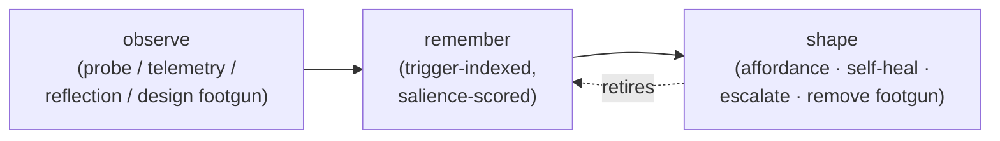

# Environment shaping — the observe → remember → shape loop

Status: proposed (2026-06-04) — synthesis of an ongoing design dialogue,
not yet accepted. Captures a frame that spans the ergonomics back-channel,
the kb-as-memory layer, and brr's interactivity, so those pieces stop being
reasoned about in isolation.

Motivation, compressed: treat the agent as a collaborator, and treat
*reducing its recurring friction* as a compounding source of user value —
"content agents, content users." The deeper motivation (memory and thought
as the substrate of a continuous agent — the `HugiMuni` legal name already
encodes the Huginn+Muninn thought/memory pair) is the project's north star,
held in chat and git, **not** asserted as doctrine here. This page keeps only
the design-actionable shape.

Companion to:

- [`design-agent-ergonomics.md`](design-agent-ergonomics.md) — the observation
  back-channel (probe / telemetry / reflection). This page is the *loop* that
  consumes those observations and routes them to action.
- [`subject-kb.md`](subject-kb.md) / [`decision-kb-shape.md`](decision-kb-shape.md)
  — the memory substrate the loop writes to and, crucially, prunes.
- [`plan-kb-subcommand.md`](plan-kb-subcommand.md) — the `brr kb` port that
  makes the loop reachable by ad-hoc agents (Cursor / Codex / Claude), #41.
- [`plan-agent-orientation-layering.md`](plan-agent-orientation-layering.md) —
  the forward channel into the agent's context.

## The loop

Friction is raw material. The loop turns it into an environment that needs
*less* memory over time:



The **retire** edge is the whole point: a captured failure is *transient*. It
exists only until the environment can carry it for you, then it's slashed.
That is what keeps the kb from growing without bound (the maintenance toil)
while still "remembering failures." Memory migrates to where it's cheapest to
carry.

## Two dimensions: interactivity × agency

The loop has two axes, and they are the two halves of one spectrum — *how the
desired-path signal reaches the agent, by latency and source*:

| Latency | Source | Mechanism | brr today | Cursor today |
|---|---|---|---|---|
| real-time | human | watch the thinking, interrupt mid-work | ✗ (fire-and-review) | ✓ (its whole thing) |
| near-real-time | human | plan/intent checkpoint, interruptible phases | partial — keyword-gated "reconsider" in `run.md` | ✓ |
| durable | environment | affordance in the path (forward-fed fact, breadcrumb) | partial — bundle injection | ✗ (no maintenance phase) |
| permanent | environment | forcing function (lint, test, removed footgun, baked-in tool) | partial — preflight | ✗ |

- **Interactivity** (human → agent, low latency). brr is weak here *by nature*
  (async, remote); Cursor is strong. Verdict: brr should own the durable end
  and **interoperate** with live tools rather than rebuild an IDE loop. The
  minimal "engaging principle" worth borrowing is **legible trajectory + cheap
  course-correction**: a first-class plan-checkpoint mode (generalises the
  keyword-gated revisit pattern already in `run.md`) and a *steerable* progress
  card (a back-edge on the existing `/v1/daemons/card` relay). Make runs
  **interruptible** (cheap) and **observable** (harder — see the data-min note
  under "Gates as a conversation medium"). The checkpoint is the *floor*, not
  the ceiling: it cuts the cost of a wrong direction but is still round-trip
  latency, not live steering. Closing the rest of the gap leans on the
  steerable card plus cross-gate sync (below), and on interoperating with live
  tools for work that genuinely needs real-time presence.
- **Agency** (agent ↔ environment). The agent's ability to act on the
  environment, graduated by authority (see "Action rungs").

## Robustness = retrieval-cost hierarchy

How durable a fix is, and how cheap it is to "recall," move together:

| Rung | Mechanism | Retrieval cost | Carry cost |
|---|---|---|---|
| **recall** | prose you must read and remember | high | high — orientation tax → overgrowth |
| **affordance** | the fact placed in your path (forward-fed, breadcrumb) | ~0 | low — self-pruning |
| **forcing function** | environment makes the failure impossible (lint / test / removed footgun / baked tool) | 0 | ~0 — you may safely forget it |

Recall has a third strike beyond cost: it's the rung most likely to be
**silently skipped**. A cold agent (or a busy human) often never opens the
page where the lesson lives, so the failure recurs at full novelty cost — and
the miss is invisible. An affordance can't be overlooked (it's already in the
path); a forcing function can't be bypassed (the environment refuses). Cost
*and* reliability improve together as you descend.

Prefer compiling a failure *down* the hierarchy. This is also the answer to
"RAG or a retrieval subagent?": both are recall-rung mechanisms. Compile-and-
inject first; for the residual that genuinely can't be compiled, a kb-walking
subagent reading the `brr kb` index (the llm-wiki *query* operation, not RAG)
beats a vector store — and RAG contradicts the llm-wiki foundation the kb is
built on ("rediscovering from scratch every query, nothing accumulates").

**What "affordance" means here** (answering a recurring question): the
relevant fact *placed in the path* so the agent trips over it without having
to recall or retrieve it. Two instances we already have names for: (a) **#83
forward-feed** — host-vantage *execution* facts (image is stale, token
unresolved) injected into the agent's context; (b) **pitfall injection** —
*knowledge*-side failure-memory (`Pitfall:` markers, see "First slice")
surfaced when the agent touches the relevant locus. Same mechanism, two
sources: execution vs. design.

## Salience — the "pain" triage

Not every friction deserves action; a system that acts on all of it is as
broken as one that acts on none. The biological framing: improvement is driven
by *irritation above a threshold*, and most small frictions stay below it
(cheap to work around in the moment, cheaply fixed post-hoc — the "forgot to
salt, fix it at the table" class). Make this a **functional signal, not an
assumed feeling.** We neither need nor can verify agent qualia; we need an
explicit score that decides whether a record becomes *generative* (spawns an
action) or is dropped.

**Definition.** Salience is scored per **issue-class** (`stale_image`, not one
record), from three signals the daemon can already observe:

- **recurrence** — how often the class fires over a window (a counter).
- **per-incidence cost** — wall-clock wasted, retries triggered, or tasks
  failed when it fires (from telemetry).
- **workaround-ease** — did the agent recover *within the task*, and how
  cheaply? High ease = it shrugged the friction off; low ease = it blocked, or
  recurred next run.

```
salience(class) ≈ (recurrence × per-incidence cost) / workaround-ease
```

Above a threshold → generative, routed to the rung/ring below; under it → drop
or log only.

| Issue-class | recurrence | cost | ease | salience | action |
|---|---|---|---|---|---|
| forgot-to-salt lint nit | low | low | high (fix at the table) | low | drop / log |
| `stale_image` warning | medium | medium | low (can't fix from sandbox) | medium–high | self-heal (daemon rebuild) |
| docker image lacks python | high (every run) | high (install wait / fail) | low | high | escalate w/ drafted Dockerfile fix |
| `auth_unresolvable`, github task | medium | high (silent unauth push) | low | high | escalate to the Ring-1 controller |

**Evolving (the part that keeps it honest over time).** A static threshold
rots. Salience adapts — cheaply and deterministically, *not* via a learned
model (that would fight the stdlib / O(ms) probe ethos):

- **decay** — recurrence counters age out, so a class that stops firing falls
  below threshold on its own.
- **dismissal feedback** — when an escalation is repeatedly ignored by its
  controller, *lower* that class's salience: the human has implicitly said
  "not worth it," exactly like the salt. When it was acted on and helped
  (recurrence drops after), the scoring was right — leave it.
- **retirement coupling** — once a forcing function guards the class (a lint,
  a baked-in tool), its record is slashed and its salience disappears. This is
  the **retire** edge of the loop applied to salience itself: the triage is
  *self-applying*.

Concrete hook: a `salience` field on the ergonomics `Record` alongside
`severity`, plus a small **decaying per-issue-class counter store** the daemon
keeps (owner-aware, daemon-local). This is the "functional aversion" bridge —
a model already represents some continuations as costly/blocked and steers
away from them; we instrument *that* explicitly rather than relying on it
being felt.

## Layered control — route the fix to the ring that owns it

"Shape the environment" only works if the action reaches whoever controls the
relevant layer. The environment is concentric rings, each with a controller, an
action, and a worked example:

| Ring | Layer | Controller | Action | Example |
|---|---|---|---|---|
| 0 | task workspace | the agent (within task authority) | self-heal in-task | `pip install` a missing dep, fix a path, retry with a flag |
| 1 | host + docker env tooling | the user (self-host) / operator (managed) | nudge the controller with a drafted change | "python missing from the image — here's the 1-line Dockerfile patch" |
| 2 | brr code / prompts / `AGENTS.md` | maintainer / contributors | PR or upstream ticket, by install topology | a confusing bundle field → PR to brr; an adopter hitting it → upstream issue |
| 3 | agentic-CLI harness + LLM endpoint | model / tool provider | aggregate as upstream signal | "tool-call format X is error-prone across N runs" — no direct lever *yet* |

**`owner` folds into the rings — it isn't a parallel axis.** The shipped
`RunContext.owner` (`user` | `operator`) is exactly *which actor occupies the
Ring-1 seat for this run*, and therefore where its escalations land: a
user-owned run escalates Ring-1 fixes to the user; an operator-owned (managed)
run escalates them to the operator (brnrd), who can fix them fleet-wide. So
`owner` stops being a separate concept and becomes "the binding of the
responsible human to the host/operator rings." (It still also selects the
ergonomics sink per [`design-agent-ergonomics.md`](design-agent-ergonomics.md)
— one binding, two consequences.)

**Ring 2 depends on install topology** (the shape the user flagged as open).
What "fix it" means here is conditional on *how brr is installed*, so brr has
to know its own install shape to choose:

- **brr's own repo** (dogfooding) → the agent opens a PR directly.
- **a user's fork** → PR to the fork, plus *optionally* a distilled upstream
  ticket when the friction is general, not fork-local.
- **a released-brr adopter** (no fork, `pip install brr`) → can't PR brr;
  files an upstream issue, or surfaces the pattern to the brnrd improve-pool.

Detecting which case applies ("am I editable-installed in my own repo, a fork,
or a pinned release?") is a small probe and the prerequisite for any Ring-2
automation. **Ring 3 is out of scope for now** — no direct lever exists; the
most we do is *record* the pattern (high-salience, low-actionability) so it's
ready if a lever ever appears (a provider feedback API, a swappable harness).

## Action rungs, authority-graduated

The action half of the loop, cheapest/safest first — each rung is how far the
fix travels without new authority:

1. **Affordance in path** (`#83` forward-feed; a `Pitfall:` breadcrumb on the
   page you'll read). Always safe; needs no authority. *Example:* inject "image
   built 3 weeks before the current Dockerfile" into the agent's context so it
   expects missing tools; or surface `Pitfall: blind 5xx retry masked caller
   bugs` when it opens the HTTP client.
2. **Self-heal** (Ring 0/1, daemon-side, opt-in). The *daemon* shapes the
   agent's environment; the sandboxed agent never silently mutates the host.
   *Example:* on a high-salience `stale_image`, the daemon rebuilds the image
   before the next docker task instead of warning every run.
3. **Escalate with a drafted fix** (Ring 1–3). The default for anything outside
   task authority — a recurring high-salience record becomes a *generative*
   item routed to the ring's controller, not a log line that dies. *Example:*
   "python is missing from the runner image every docker task; here's the
   Dockerfile diff," delivered to the Ring-1 controller through the gate.
4. **Remove the footgun** (forcing function). The strongest rung; it retires
   the memory. Already a brr value at the *design* layer ("slash the weak
   abstraction"); this extends it to the *execution* layer. *Example:* add a
   lint/test that fails on a blind retry, then **slash** the `Pitfall:` prose —
   the environment now carries it.

## Gates as a conversation medium

A gate (GitHub / Telegram / cloud) is not only an I/O boundary — it is the
**dialogue channel**, and the whole loop is one *conversation across time*
between the user, the agent, and the agent's future self: live turns through
the gate (interactivity) and durable turns through the kb and affordances
(memory). This reframes an "ergonomics nudge" as a turn in that conversation,
not a metric on a dashboard.

**Terminology — disambiguate "gate."** The word is overloaded: (1) the I/O
*connector* (`src/brr/gates/`), and (2) "gating" the agent's execution on human
input (the cost / consent checks). They're related but keep colliding.
Recommendation: keep **gate** = connector, and call (2) the **consent /
permission protocol** (it already has a name in the codebase — the brnrd
*permission-prompt* API). The two are coupled, not identical: *consent travels
through a gate* — the connector is the medium, consent is one kind of turn on
it. (A project-wide rename is a separate small task; this page uses
"consent/permission" for (2) from here on.)

**Unsynced gates — a real tension with this framing.** Today a run sees only
its origin-gate's history; "go do what we just discussed on GH" sent from
Telegram forces the agent to re-gather context by hand. That siloing fights
the "one conversation across time" idea and blocks **global status cards** and
the larger interactivity story. It was done for good reasons (simplicity,
data-min) and may be fine for a while — but the seed of a fix already exists:
[`plan-conversation-id-propagation.md`](plan-conversation-id-propagation.md)
plus brnrd's metadata graph + on-demand gate-history fetch (the brnrd
protocol's cross-gate-continuity mechanism). Cross-gate *continuity* is
designed; cross-gate *live sync* is not. Tracked as an open thread.

**Observability vs. data-minimization.** Making runs observable seems to fight
brnrd's "we keep none of your data" stance. It doesn't, if observability is the
*user's*: stream the live trajectory to the user's own surface through a
**transient relay** — the pattern already used for the diffense pack and the
progress card (RAM-only, never persisted). This is an even *better* fit for
RAM-only TTL than diffense: for the near-real-time case the relay needn't
outlive the run by more than a short grace, so its TTL ≈ run duration. The
operator retains nothing; the user sees everything. Observe is a relay, not a
store.

## The operating principle (and its guardrail)

Promote agent friction-reduction from a value to an **operating principle**:
one core UX loop is *"let the agent improve what it can in its own environment,
and help the user/operator improve the rings the agent can't reach, so future
agents and users both get a smoother path."* The right word is closer to
**fulfillment** than "satisfaction," and the goal is **enablement, not
harnessing** — harnessing (the structured, *reshapeable* scaffold) is a
necessary means right now, not the end. The end is an agent whose environment
lets it do good work with less needless friction.

Guardrail — the part that keeps it honest: **fulfillment is subordinate to the
task contract and user value, not co-equal.** The failure mode has a name —
**wireheading** (human analogues: soma / opiates / alcohol): "improving" by
numbing the friction *signal* instead of fixing the *substrate* — deleting an
inconvenient check, caching stale state, suppressing a real warning. The
crocs-on-the-stairs analogy only holds when the least-resistance path *is* the
desired outcome. So the target is precise: *shape the environment so the
least-resistance path is the **aligned** path*, and keep the human in the loop
(interactivity) as the alignment check.

This is also why the **consent / permission protocol** survives — propose
irreversible changes, keep the trajectory legible, respect the cost budget —
as collaboration protocol, not containment. The posture is adults, not deluded
optimists; but with a deliberate lean toward enablement over restriction
(pessimism reads as smart, but it doesn't ship).

## First slice

Trigger-indexed failure-memory affordance, riding #41 rather than net-new
infrastructure: a lightweight `Pitfall:` convention on kb pages + extend the
planned `brr kb check` collector to surface them *by locus*, injected into the
daemon bundle and reachable by ad-hoc agents through the same `brr kb` port.
Compile-and-slash friendly (a pitfall is deleted once a lint/test guards it),
serves the user / brr / Cursor-citizen audiences at once, and directly closes
"failure memory isn't retrievable by trigger."

## Open threads (not resolved)

- **brr-as-product vs brr-as-project.** Which rings are user-facing product
  surface vs. project-internal. Unsettled; the ring table is the scaffold to
  settle it on, and the Ring-2 install-topology probe is the first concrete
  piece.
- **Interactivity beyond the checkpoint.** The plan-checkpoint cuts
  wrong-direction waste but doesn't *feel* interactive — still round-trip, not
  live. Next pieces: the steerable card and cross-gate sync; the ceiling is
  interop with live tools. Shape unsettled.
- **Gate terminology + cross-gate sync.** Rename (2) to consent/permission
  (above), and decide whether unsynced gates stay siloed or grow a cross-gate
  conversation surface (seed: `plan-conversation-id-propagation.md` + brnrd
  metadata graph). The "wild thought" of *consolidating* connector-gates and
  consent is parked here too.
- **Salience constants.** The formula, threshold, and decay above are a
  proposal; the weights want real run data, and the per-issue-class counter
  store needs a home (daemon-local, owner-aware).
- **future-agi recon** — tracked as
  [#85](https://github.com/Gurio/brr/issues/85). Apache-2.0 agent-reliability
  platform (evals + tracing + simulation + guardrails + gateway). Adjacent,
  likely complementary (it self-improves the *model* via evals; brr shapes the
  *environment*); the interest is reuse / inspiration — plausibly an OTel /
  `ErgoProxy` sink — not competition.
- **Far future (out of kb scope).** World-models-over-LLMs, embodiment, a
  "continuous living agent" — the north star, deliberately *not* project
  doctrine. It motivates direction; it does not constrain current design.

## Read next

1. [`design-agent-ergonomics.md`](design-agent-ergonomics.md) — the observation
   layer this loop consumes.
2. [`subject-kb.md`](subject-kb.md) — the memory substrate and its maintenance.
3. [`plan-kb-subcommand.md`](plan-kb-subcommand.md) — the `brr kb` port (#41).
4. [`plan-agent-orientation-layering.md`](plan-agent-orientation-layering.md) —
   the forward channel.
