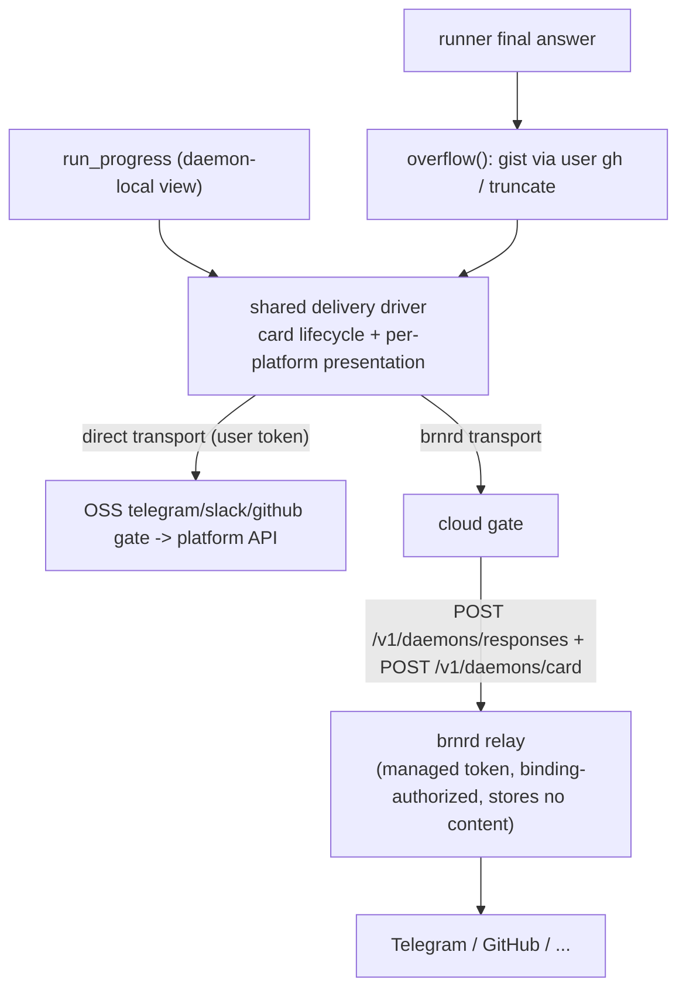

# Design: managed-mode delivery — one driver, two transports

Status: accepted 2026-06-01 (delivery shape **H**). Locks how a run's
human-facing output (the live progress card and the final response) is
rendered and delivered in **both** self-hosted and managed mode, so the
cloud gate reuses the OSS gates' rich behaviour instead of
re-implementing it inside brnrd. Companion to
[`design-brnrd-protocol.md`](design-brnrd-protocol.md) (the wire
contract this builds on) and [`subject-managed-mode.md`](subject-managed-mode.md).

## The problem this closes

The OSS gates do real delivery work: a **live progress card** (post a
message on `run_created`, edit it in place through `running →
finalizing → done`) and **overflow handling** for the final response
(too long → offload to a gist via the user's `gh`, else truncate). See
the Telegram gate's `render_update` / `_send_with_overflow` in
[`src/brr/gates/telegram.py`](../src/brr/gates/telegram.py); the GitHub
gate has the same card shape per
[`design-github-gate-vs-brnrd-app.md`](design-github-gate-vs-brnrd-app.md).

In managed mode the `cloud` gate ([`src/brr/gates/cloud.py`](../src/brr/gates/cloud.py))
had none of it: it shipped the raw response body to brnrd and emitted no
progress card at all. The tempting fix — teach brnrd to chunk / format /
render cards — duplicates the gate behaviour on the server and is
**impossible for the card**, because the card is rendered from
`run_progress`, which reads daemon-local `.brr/runs/`. brnrd cannot see
it.

So the shape is forced, and it happens to be the right one:

> **Render daemon-side; vary only the transport.** One delivery driver,
> shared by the OSS gates and the cloud gate. The OSS gates drive it with
> a direct transport (the user's own bot/app token → platform API). The
> cloud gate drives the *same* driver with a brnrd transport (POST →
> brnrd → managed token → platform API). brnrd stays a transient relay
> that formats nothing it doesn't have to and stores no content.

## The seam

**Invariant.** The bot/app token lives only in the side that owns the
platform identity — the user's daemon (self-hosted) or the brnrd relay
tier (managed). Everything upstream of the transport is a renderer. Any
daemon-equivalent — laptop, BYO-Fly, or a brnrd-spawned managed-Fly
sandbox — renders its own progress and drives a transport; it never
holds the managed token.

## What is shared (the driver)

A daemon-side module (lands as `src/brr/gates/delivery.py`, or by
extending the existing [`src/brr/gates/runtime.py`](../src/brr/gates/runtime.py)
that already factored out gate state / loop / response-delivery):

- **Per-platform presentation** (pure). Card text from
  `run_progress.render_text(view, style=…)` with the platform's style
  (`TELEGRAM_HTML_STYLE`, etc.) + escaping; final-response formatting.
  The card *model* (`run_progress.project_run`) is already
  platform-agnostic; only the style and escaping are platform-specific.
- **`overflow(text, limit, gh)`** — the gist/truncate decision currently
  inside the Telegram gate's `_send_with_overflow`, lifted out so the
  cloud gate uses it too. Runs daemon-side (see "Why gists stay
  daemon-side").
- **`CardDriver`** — the send-once → edit-in-place lifecycle: store the
  posted `message_id`, skip the round-trip when the rendered text is
  unchanged, fall through to a fresh post if the original was deleted.
  This is today's `telegram.render_update` body, made transport-agnostic.

### Agent-owned card narration

The card body is **daemon-rendered + agent-narrated**. The lifecycle
scaffolding (header, sync line, vertical phase log, terminal state) stays
daemon-owned. On top of it, the resident can compose a short narration
of what it is actually doing by writing the `.card` control dotfile in
its per-run outbox; the daemon promotes it on each heartbeat into a
`card_composed` packet, which lands on
`RunProgressView.agent_card_text` and renders as a `note: …` tail line
under the live phase. Rewrite the file to update; empty/delete it to
withdraw. The seam is single-source (the latest `card_composed` wins)
and additive (gates that drive `CARD_PACKETS` re-render automatically).

The relay-not-store invariant is intact: the agent's narration travels
the same daemon-rendered → transport path as the rest of the card body;
brnrd still holds only the `message_id` it needs to edit. See
[`design-co-maintainer.md`](design-co-maintainer.md) §8 for the
larger card re-alignment context this slice fits into.

## What varies (the Transport)

A small interface — roughly `send(text, reply_to) -> message_ref` and
`edit(message_ref, text)` — with two implementations:

- **Direct** (OSS gates): calls the platform API with the user's own
  token. Behaviour identical to today.
- **brnrd relay** (cloud gate): the driver's `send`/`edit` become POSTs
  to brnrd, which executes them with the **managed** token. Final
  response rides the existing `POST /v1/daemons/responses`; the card
  rides the additive `POST /v1/daemons/card` (see
  [`design-brnrd-protocol.md`](design-brnrd-protocol.md) → "Live
  progress card relay"). brnrd verifies the target chat/repo against the
  event's binding (the clamp that stops the relay from being an open
  send-proxy) and holds only the card `message_id` it needs to edit —
  routing metadata, never the text.

The cloud gate is multi-platform on receive (it drains a unified inbox
whose events carry their origin platform) and therefore on deliver too:
it picks the presentation by the event's `source.platform`, reusing the
same per-platform presentation modules the OSS gates use.

## Why this generalizes to remote envs (Fly)

A managed-compute spawn is a **daemon-equivalent** — same env class, two
callers, per the "Caller axis" in
[`research-cloud-envs.md`](research-cloud-envs.md) and
[`design-brnrd-protocol.md`](design-brnrd-protocol.md) step 6's
daemon-equivalent bootstrap. It holds its own `.brr/`, runs
`run_progress`, renders its own card, and drives the brnrd transport
exactly as a laptop cloud gate would. Nothing about the driver is
laptop-specific; "the daemon renders" means "whatever runs the runner
renders", wherever it runs.

## Why gists stay daemon-side

The overflow gist is created with the user's own `gh`, on the user's own
GitHub account, and brnrd relays only the short link. Putting overflow
on brnrd would force brnrd to hold gist-capable credentials — a
data-ownership regression against
[`design-brnrd-protocol.md`](design-brnrd-protocol.md) → "Data
minimization", and not even possible cleanly (a GitHub App cannot create
*user* gists; only a user-scoped `gist` token can). Keeping `overflow()`
in the daemon-side driver makes the cloud gate produce the gist as the
user and pass brnrd a link — strictly better on trust and the only shape
that works. (This also retires the stopgap brnrd-side chunking added
2026-06-01 for Telegram's 4096-char limit; it becomes a removable safety
net once the daemon guarantees the body fits.)

## Why H, and what U would change

Two coherent shapes were weighed:

- **H (chosen).** Keep brnrd formatting the *final answer* per the
  accepted response shape; the daemon just runs `overflow()` first so
  the body fits one message. Add a thin progress-card relay for the
  card. **Purely additive** to the accepted protocol; brnrd keeps its
  per-platform markdown adaptation, which makes adding Slack / Discord /
  GitLab cheaper (only brnrd changes for the answer path). The shared
  daemon-side driver is what satisfies "make the gate behaviour generic"
  — that goal is met at the *logic* layer regardless of wire shape.
- **U (deferred).** Daemon renders everything (answer included) into
  platform-ready text; brnrd becomes a formatting-free send/edit relay
  for the response too. One wire mechanism, brnrd the dumbest possible
  pipe (strongest data-min story). But it **reshapes** the accepted
  response shape and pushes per-platform presentation for every managed
  platform onto the daemon — churn for a mostly-philosophical gain.

H ships faster and breaks no accepted contract; U stays a clean future
move if brnrd should ever become a pure pipe. The deciding value was
maintainability + the self-host promise (below).

## Self-host promise

The driver makes the self-host story automatic. Adding a gate (say
Slack) means writing its presentation + a direct transport — and it
**works locally the moment you have your own bot creds**, with no brnrd
in the loop. The managed path then comes "for free": the same driver
with the brnrd transport. One implementation, two transports, no fork
between the OSS gate and its managed counterpart.

## Implementation sketch (sequenced; not in this commit)

1. Extract `src/brr/gates/delivery.py`: `Transport`, `CardDriver`,
   `overflow()`. Convert [`src/brr/gates/telegram.py`](../src/brr/gates/telegram.py)
   to use it via a direct transport — no behaviour change; the
   `test_telegram_render_update.py` suite stays green. (Slack / GitHub
   conversion follows; each deletes its bespoke card code.)
2. brnrd: `edit_message` in
   [`src/brnrd/platforms/telegram.py`](../src/brnrd/platforms/telegram.py)
   + the `POST /v1/daemons/card` relay in
   [`src/brnrd/routers/daemons.py`](../src/brnrd/routers/daemons.py)
   (binding-authorized, managed token, `message_id` per `event_id`, text
   not stored).
3. cloud gate: implement `render_update` driving `CardDriver` over the
   brnrd transport, dispatching presentation by origin platform; add
   `cloud` to the progress dispatch in
   [`src/brr/updates.py`](../src/brr/updates.py) (currently hardcoded to
   `telegram` / `slack` / `github`) or generalize it to configured gates.
4. cloud gate: run `overflow()` on the response body before POSTing, so
   the body fits; brnrd's `split_message` becomes a removable safety net.

## Read next

1. [`design-brnrd-protocol.md`](design-brnrd-protocol.md) — the wire
   contract; "Response shape" + the additive "Live progress card relay".
2. [`subject-managed-mode.md`](subject-managed-mode.md) — strategic
   context (brnrd as thin dispatcher + transient relay).
3. [`research-cloud-envs.md`](research-cloud-envs.md) — the caller axis
   that makes a managed-Fly spawn a daemon-equivalent renderer.
4. [`design-diffense.md`](design-diffense.md) — a sibling use of "brnrd
   is a transient relay, never a store" (for review packs, not gate
   delivery).
